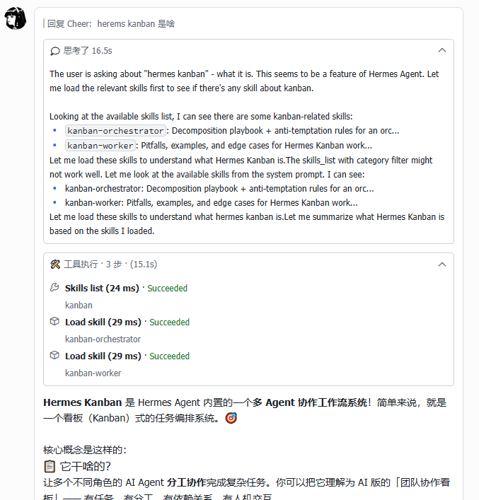

# Changelog

All notable changes to this project will be documented in this file.

The format is based on [Keep a Changelog](https://keepachangelog.com/en/1.1.0/),
and this project adheres to [Semantic Versioning](https://semver.org/spec/v2.0.0.html).

---

## [0.5.0] - 2026-05-15

### Highlights

- 原生推理流式展示：实时展示模型原生推理过程，打字机效果逐字输出。
  

  开启方式（二选一）：
  - 在 `~/.hermes/config.yaml` 中配置 `display.platforms.feishu.show_reasoning: true`
  - 在对话中发送 `/reasoning on` 即可开启

### 新增

- 新增第 8 个 hook `on_reasoning_delta`，注入 `agent.reasoning_callback`，接收模型原生推理增量。
- `Config.show_reasoning` 配置项，支持平台级（`display.platforms.feishu.show_reasoning`）和全局（`display.show_reasoning`）两级配置。
- `build_streaming_card_v2` 新增 `show_reasoning` 参数，启用时预置空 reasoning 面板。
- reasoning 面板标题：空内容时显示"Thinking/思考中"，有内容后切换为"Thought/思考"。

### 变更

- 统一三处卡片元素顺序为 reasoning → tool → answer。
- `_build_reasoning_panel` 新增 `expanded`、`element_id` 参数，标题改为 `plain_text` + `text_color: grey` + `text_size: notation`，与工具面板风格一致。
- IM fallback 路径 reasoning 展示条件从 `if reasoning_text and not text` 改为 `if reasoning_text`，始终展示推理内容。

### Highlights

- Native reasoning streaming: display model's native reasoning process in real-time with typewriter effect.
  

  Enable (either option):
  - Set `display.feishu.show_reasoning: true` in `~/.hermes/config.yaml`
  - Send `/reasoning on` in the conversation to enable temporarily

### Added

- Add 8th hook `on_reasoning_delta` that injects `agent.reasoning_callback` to receive native reasoning deltas.
- `Config.show_reasoning` property with platform-level (`display.platforms.feishu.show_reasoning`) and global (`display.show_reasoning`) fallback.
- `build_streaming_card_v2` gains `show_reasoning` param — when enabled, pre-adds an empty reasoning panel.
- Reasoning panel title shows "Thinking" when empty, switches to "Thought" when content arrives.

### Changed

- Unify element order to reasoning → tool → answer across all card builders.
- `_build_reasoning_panel` gains `expanded` and `element_id` params; title changed to `plain_text` + `text_color: grey` + `text_size: notation` to match tool panel style.
- IM fallback reasoning display condition changed from `if reasoning_text and not text` to `if reasoning_text` — always show reasoning content.

---

## [0.4.5] - 2026-05-12

### 修复

- 修复 `_do_update_card` 在流式模式关闭后仍调用 `cardkit_stream_element`，产生大量 300309 错误刷屏日志的问题。修复 #7. (#9) 感谢 @Mxin-9527.
- 修复 `_do_complete` 重试全失败后会话状态被错误设为 `COMPLETED`，应为 `FAILED`。修复 #7. (#9)
- 修复 markdown 表格降级未应用到所有渲染路径的问题。 (#8) 感谢 @Bandersnatch0x.

### 变更

- 新增 ruff lint/format 和 mypy 类型检查，统一代码风格。 (#6)

### Fixes

- Fix `_do_update_card` calling `cardkit_stream_element` after streaming mode closed, causing excessive 300309 errors in logs. Fixes #7. (#9) Thanks @Mxin-9527.
- Fix `_do_complete` incorrectly setting session state to `COMPLETED` after all retries failed — should be `FAILED`. Fixes #7. (#9)
- Fix markdown table downgrade not applied to all render paths. (#8) Thanks @Bandersnatch0x.

### Changed

- Add ruff lint/format and mypy type checking for consistent code style. (#6)

---

## [0.4.3] - 2026-05-12

### 修复

- 修复 `message_id` 为 `None` 时 `on_message_started` 崩溃（`TypeError: 'NoneType' object is not subscriptable`），导致后续所有流式卡片失效直到重启。修复 #4. (#5) 感谢 @gitteeee.
- 修复 `_prune_stale_sessions` 遇到 `None` 键时崩溃的问题。修复 #4. (#5)

### Fixed

- Fix `on_message_started` crash when `message_id` is `None` (`TypeError: 'NoneType' object is not subscriptable`), which broke all subsequent streaming cards until gateway restart. Fixes #4. (#5) Thanks @gitteeee.
- Fix `_prune_stale_sessions` crash when encountering `None` keys in session map. Fixes #4. (#5)

---

## [0.4.2] - 2026-05-11

### 变更

- 优化流式卡片打字机渲染频率（35ms/字），减少文字积压导致的突然上屏。
- 清理流式卡片构建函数中的冗余代码。

### Changes

- Optimized streaming card typewriter rendering frequency (35ms/char) to reduce sudden text appearance.
- Cleaned up redundant code in streaming card builder.

## [0.4.1] - 2026-05-11

### 变更

- Footer 默认布局改为单行紧凑模式（`[[status, elapsed, context, model]]`），`show_label` 默认改为 `false`。
- 重构 README 章节，调整顺序并合并降级策略到工作原理，新增更新章节。

### 新增

- 新增 GitHub Actions release workflow，推送 `v*` tag 时自动从 CHANGELOG.md 提取内容创建 release。

### Changed

- Footer default layout changed to single-row compact mode (`[[status, elapsed, context, model]]`), `show_label` default changed to `false`.
- Restructured README sections, merged degradation strategy into How It Works, added Update section.

### Added

- Add GitHub Actions release workflow that auto-creates releases from CHANGELOG.md on `v*` tag push.

---

## [0.4.0] - 2026-05-10

### 重要修复

- 修复工具调用后卡片输出丢失流式效果：长空闲恢复时节流定时器被反复重设，导致文字累积但从未推送到卡片。
- 修复完成态卡片丢失工具调用前的文字：多轮对话中完成态只保留了最后一轮内容，工具调用前的文字被丢弃。

### 新增

- 新增 `update_card`、`tool_update`、`do_complete` 的 info 级别日志，方便排查流式输出问题。

### Fixes

- Fix card losing streaming effect after tool calls: throttle timer was endlessly rescheduled during long-gap recovery, causing text to accumulate but never flush to the card.
- Fix completion card losing text before tool calls: in multi-turn conversations, only the last turn's content was kept, discarding earlier text.

### Added

- Add info-level logs for `update_card`, `tool_update`, and `do_complete` events to aid streaming output debugging.

---

## [0.3.0] - 2026-05-09

### Highlights

- 消息打断处理：用户发送新消息可中断正在生成的回复，支持嵌套中断（A→B→C）
  

### 新增

- 新增第 7 个 hook `on_message_interrupted`，处理用户发送新消息打断正在处理的回复。
- `_interrupt_map` 机制：中断时映射旧消息 ID → 新消息 ID，`on_completed` 通过重定向将旧消息的完成结果传递给新会话。
- 支持嵌套中断（A→B→C），自动更新映射链。

### 修复

- 修复消息打断时旧卡片未终止、新卡片未创建的问题。

### Highlights

- Message interrupt handling: send a new message to interrupt the ongoing reply, with nested interrupt support (A→B→C)
  

### Added

- Add 7th hook `on_message_interrupted` for handling message interrupts when user sends a new message while agent is still processing.
- `_interrupt_map` mechanism: maps old message ID → new message ID on interrupt, `on_completed` redirects the old message's completion to the new session.
- Support nested interrupts (A→B→C) with automatic chain update.

### Fixed

- Fix old card not terminated and new card not created on message interrupt.

---

## [0.2.0] - 2026-05-09

### 新增

- 使用 CardKit batch_update API 延迟渲染工具面板，首次工具调用时插入，后续事件仅局部更新，避免重建整个卡片。
- 新增 patcher 测试，基于 Hermes 环境中的真实 run.py 执行注入/移除/幂等性/备份恢复测试。

### 修复

- 修复 `tool_panel_added` 标志在 API 调用前被设置，导致失败后无法正确重试的问题。
- 修复模型在同次响应中先输出文本再调用工具时，工具面板不更新的问题。
- 修复卡片创建失败时未正确让出给 gateway 默认回复的问题。

### Added

- Use CardKit batch_update API to lazy-render tool panel — insert on first tool event, then update element locally, avoiding full card rebuilds.
- Add patcher tests using real run.py from Hermes environment for inject/remove/idempotency/backup-restore coverage.

### Fixed

- Fix `tool_panel_added` flag being set before API call, preventing correct retry on failure.
- Fix tool panel not updating when model outputs text before tool calls in the same streaming response.
- Fix card creation failure not yielding to gateway default reply.

---

## [0.1.1] - 2026-05-08

### 新增

- 新增 `AGENTS.md`，包含架构概览与开发指南。

### 变更

- 精简 `optimize_markdown_style`，移除不必要的 ` ` 间距逻辑（连续标题、表格、代码块前后填充）。空行压缩已足够适配 CardKit 渲染。
- 移除 5 个模块中的冗余代码。

### Added

- Add `AGENTS.md` with architecture overview and development guide.

### Changed

- Simplify `optimize_markdown_style` by removing unnecessary ` ` spacing logic (consecutive headers, tables, code-block padding). Blank-line compression is sufficient for CardKit rendering.
- Remove redundant code across 5 modules.

---

## [0.1.0] - 2026-05-08

### 新增

- `hermes-lark-streaming` 初始版本 — 基于飞书 CardKit v2.0 的 Hermes Gateway 实时流式卡片插件。
- 通过 CardKit `streaming_mode` 实现打字机效果的流式输出。
- 展示推理/思考内容。
- 实时工具调用状态追踪，含图标、结果块和错误块。
- CardKit 流式失败或频控时自动降级到 IM PATCH。
- 完成态卡片，页脚展示元数据（耗时、模型、token 用量、上下文窗口）。
- `UnavailableGuard` — 源消息被删除或撤回时自动终止后续更新。
- `ImageResolver` — 异步识别 markdown 图片 URL，下载并上传为飞书 `img_key`。
- AST 注入 6 个 hook 到 `gateway/run.py`（`on_message_started`、`on_answer_delta`、`on_thinking_delta`、`on_tool_updated`、`on_message_completed`、`on_message_aborted`）。
- CLI 命令：`install`、`uninstall`、`verify`、`status`、`restore`。

### 变更

- 在 README 中明确说明插件必须安装到 Hermes 自身的 Python 虚拟环境中（`~/.hermes/hermes-agent/venv/bin/python3`），而非系统 Python。避免 gateway 启动后因找不到插件而失败。

### 修复

- 移除 `strip_reasoning_tags()` 末尾的 `.strip()`，保留换行符以支持 CardKit 流式渲染。Markdown 格式（加粗、代码块、表格、列表）现在在流式阶段即可正确渲染，不再仅在全量更新后正常显示。

### Added

- Initial release of `hermes-lark-streaming` — a real-time streaming card plugin for Hermes Gateway via Feishu/Lark CardKit v2.0.
- Streaming output with typewriter effect via CardKit `streaming_mode`.
- Display reasoning/thinking content.
- Live tool-use status tracking with icons, result blocks, and error blocks.
- Auto fallback from CardKit streaming to IM PATCH on creation failure or rate limiting.
- Completion card with footer metadata (duration, model, tokens, context usage).
- `UnavailableGuard` — auto-terminates updates when the source message is deleted or recalled.
- `ImageResolver` — asynchronously detects markdown image URLs, downloads, uploads to Feishu, and replaces with `img_key`.
- AST injection of 6 hooks into `gateway/run.py` (`on_message_started`, `on_answer_delta`, `on_thinking_delta`, `on_tool_updated`, `on_message_completed`, `on_message_aborted`).
- CLI commands: `install`, `uninstall`, `verify`, `status`, `restore`.

### Changed

- Clarify in README that the plugin must be installed into Hermes's own Python venv (`~/.hermes/hermes-agent/venv/bin/python3`), not the system Python. This prevents the gateway from failing to load the plugin at runtime.

### Fixed

- Remove trailing `.strip()` in `strip_reasoning_tags()` to preserve newlines for CardKit streaming. Markdown formatting (bold, code blocks, tables, lists) now renders correctly during the streaming phase, not just after completion.
