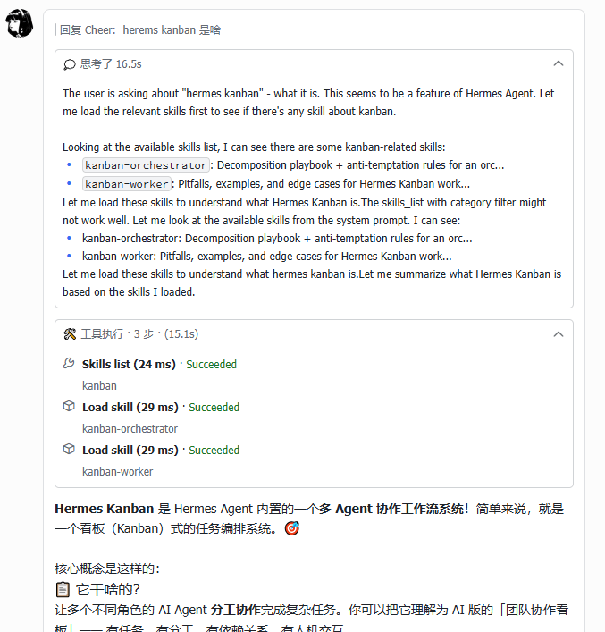
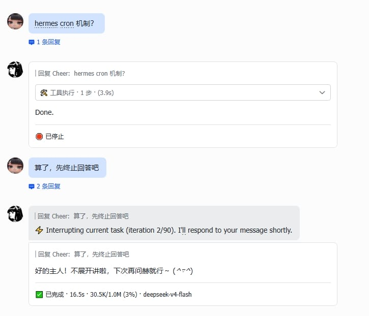

# Changelog

All notable changes to this project will be documented in this file.

The format is based on [Keep a Changelog](https://keepachangelog.com/en/1.1.0/),
and this project adheres to [Semantic Versioning](https://semver.org/spec/v2.0.0.html).

---

## [Unreleased]

## [0.20.2] - 2026-10-03

### Fixed
- Preserve known zero cache-read, cache-write and reasoning usage in the ledger. A repeated event can correct a previously nonzero value to zero; missing metadata still preserves existing values. No schema change or speculative backfill of older NULL records.
- Read period totals and model groups in one read-only SQLite transaction so concurrent WAL writers do not produce mixed-snapshot footers. Aggregate the three periods together and return independent nested cache snapshots.
- Keep history and /proc worker ownership until the blocking thread actually exits, rather than assuming an asyncio timeout stops that thread. Coalesce later sampling requests; keep terminal waiting bounded and show unavailable history if its forced refresh times out.

### Validation
- Fifteen synthetic regressions cover zero/missing usage, idempotent corrections, concurrent WAL writes, two-query aggregation, snapshot isolation, slow-thread coalescing, bounded callers and cancelled waiters. Ten of the initial eleven regression cases failed on 0.20.1 before the fix.
- 1450 full local tests, Ruff and mypy pass. A disposable 60,000-row comparison produces identical reports; medians were 48.477 ms before and 49.853 ms after in that run. Query count drops from five to two, but no fixed speedup is claimed.
- Exact-revision GitHub Tests (including the Python/Hermes compatibility matrix) and CodeQL pass. Managed 0.20.2 was subsequently deployed with an idle restart, rollback copies and unchanged configuration, credentials, core and LCM. Gateway/Feishu, doctor, installed hooks and read-only ledger health pass; new-turn acceptance after this restart is still pending. No dependency, renderer or generated-hook changes. Prior real-client/turn evidence remains explicitly scoped to 0.20.1; see `docs/assets/history-resilience-deployment-checks.json`.

## [0.20.1] - 2026-10-03

### Fixed
- Read completion `result` and strict boolean `is_error` from Hermes's existing tool callback kwargs. Current Hermes supplies `preview=None` on completion; preserve terminal stdout and nonzero exit codes instead of presenting every completion as successful. Keep the same hook/controller/writer ownership and legacy callbacks without metadata.
- Project only bounded terminal-like output fields, not read/browser/media payloads. Preserve source results; redact credentials before presentation. Correct the sensitive flag regex that previously retained the original matched secret while appending a redaction marker; cover JSON values and reserved key prefixes as well.
- Round resource percentages to one decimal while retaining unknown values and genuine zero.

### Validation
- Two real Gateway turns on managed 0.20.0 validated delivery, requested max, main/auxiliary usage separation and one terminal invocation, and exposed the missing completion metadata fixed here. The post-fix runtime acceptance is tracked separately in the deployment record.
- 1435 full tests, Ruff and mypy (49 source files) pass, including 29 added completion/redaction/resource regressions. GitHub CI and managed runtime evidence are recorded independently.
- Exact-revision Tests, CodeQL and Hermes Compat Check pass. Managed 0.20.1 and refreshed hooks were deployed with an idle restart and unchanged configuration. Two real Gateway terminal turns verify stdout and expected exit 7, separate answer/tool states, interactive readback in the independent topic, requested max and footer/ledger agreement. Current-process CardKit API errors and tracebacks are zero; one historical unknown receipt remains. Mobile authentication is expired; no mobile/pixel certification is claimed.

## [0.20.0] - 2026-10-03

### Added
- Implement the approved opt-in V1 whole-card layout: native tools and resources above the answer, model/context footer below, and optional identity tag. Preserve the legacy presentation by default.
- Align tool sequence/title/status/time, highlight failures, merge only identical adjacent output-free successful process polls, and retain bounded redacted raw records in a nested panel. Carry prior success/failure counts across clarification.
- Add controller-scoped nonblocking resource snapshots with bounded NVIDIA subprocesses, CPU deltas and Linux available-memory accounting. Add read-only timezone-aware history summaries with SQL/async deadlines, terminal refresh and an optional three-group subscription/model table.

### Fixed
- Keep the managed plugin manifest, Python package and project metadata at 0.20.0; add a regression for version agreement.
- Use CardKit-compliant element IDs of at most 20 characters; the first real create probe exposed and fixed an overlong nested-panel ID.
- Preserve top-level and nested expansion during partial updates and reuse the existing mutex/sequence writer. Bound escaped/raw text and recursive layout overhead before answer compaction; retain source-data and missing-value semantics.

### Validation
- 1406 full tests pass, including 254 new V1 cases; Ruff and mypy (48 source files) pass. Directory labels, source immutability, worst-case budgets, main/auxiliary usage, timezone boundaries, terminal refresh, timeout handling and controller ownership are covered.
- Synthetic CardKit create/attach/body stream/panel partial/close/final update and interactive fetch pass. Direct Windows Feishu inspection covers tools, resources and footer; nested records remain expanded through a real partial update. Public screenshots contain synthetic content only.
- Managed 0.20.0 is deployed after exact-revision CI and an idle Gateway restart. Doctor/hooks, clean checkouts, presentation-only configuration changes, read-only usage integrity and current-process startup checks pass. No credential/session/model/database migration. A new real Gateway turn and mobile/theme/scale/pixel-level appearance remain separate acceptance work; historical unknown receipts are preserved.

## [0.19.2] - 2026-10-03

### Changed
- Make turn details use the same shared native panel factory as background review: muted plain-text title, right-hand grey arrow, 5px corner border and 8px padding/spacing. Remove the extra separator above details in both running and final cards; retain compact paired metrics and all data semantics.
- Leave background review, reasoning and tool panel JSON unchanged when extracting their existing panel factory. No dependency, collection or Gateway-hook changes.

### Validation
- 1152 full tests pass; Ruff and mypy (45 source files) pass. Eight new regressions cover chrome parity across six lifecycle states, preserved expanded state during updates, and details-disabled mode.
- Existing synthetic preview updated through CardKit; the collapsed panels were directly inspected in Windows Feishu. The cropped real-client image contains only synthetic card content. Managed 0.19.2 is deployed with Gateway/Feishu/database health verified; this revision's expanded/mobile visual check remains separate.

## [0.19.1] - 2026-10-03

### Fixed
- Distinguish automatic card continuation from background reviews with explicit notice metadata. Streaming, recovery and final cards now label rollover notices as “Continued from previous card”; actual background reviews keep their original title. Do not infer notice type from text.

### Validation
- A real-clock synthetic run on managed 0.19.0 rotated at 481.66 seconds and finished at 488.42 seconds, with two confirmed cards, no API errors and timer cleanup. Direct client inspection exposed the misleading notice title fixed here; no model was called. Post-fix acceptance remains separate from that pre-fix evidence.
- 1144 full tests, Ruff and mypy pass. Five new notice-rendering cases cover streaming/final titles, unchanged review behavior and no text-based classification; the rollover regression asserts explicit continuation metadata.

## [0.19.0] - 2026-10-03

### Added
- Render event-driven running footers in enhanced mode: processing, answer/reasoning, tools, confirmation, context-summary requests, observed provider changes, and request failures distinct from terminal failure.
- Keep compact details available while running without resetting the reader's expanded state. Reuse the existing flush mutex, sequence, insertion anchor and element reserve; coalesce counters and use one cancellable five-second timer per active session.

### Fixed
- Preserve body pause during approval while allowing footer-only updates; suppress new scheduled flushes during manual card handoff.
- Recover missing runtime details with the existing bounded card reseed and replay body segments; footer-only updates never finalize untouched reasoning segments.
- Preserve per-turn tool totals across clarify card replacements. Separate summary request completion from compression commit and ignore late auxiliary events after the main stream resumes.

### Validation
- 1139 full tests pass, including 56 new runtime regressions; Ruff and mypy pass. Real unattached CardKit entity accepts seven phase updates, subsequent body insertion, stream close and final failure update. Gateway deployment and client visual acceptance remain separate gates.

## [0.18.1] - 2026-10-03

### Fixed
- Restore requested reasoning controls from Hermes's public `llm_execution` middleware when the ordinary pre-request body is truncated. Bind to one active nonfailed attempt with exact session, turn, request and route identity; ignore ambiguous or late events.
- Preserve downstream execution exactly once with unchanged request/result/exception semantics. Observe only whitelisted scalar controls, never persist raw kwargs or forward them to the usage ledger. Capability-gate registration on older Hermes.
- Keep requested effort distinct from server acceptance; downstream middleware may still rewrite it. An execution with no effort clears stale pre-request effort instead of inventing a configured default.

### Validation
- Added 20 regression cases, including real Hermes middleware-chain success/failure contracts. An isolated probe using local Hermes `fa6e6815d4b2` reproduced whole-request truncation and recovered `max` from structured execution kwargs without an inference call or Gateway restart.

## [0.18.0] - 2026-10-03

### Changed
- Redesign expanded details for the user's compact-density requirement: two metadata lines, four two-cell metric rows, context, and a short note instead of five tall groups. Keep exact values, wrap-safe row containers and native collapsed interaction.
- Collapse requested/reported model IDs only on exact equality; retain separate identities when different or missing. Render provider paths only when multiple routes were observed.
- Humanize known bare DeepSeek model IDs in the summary while preserving exact requested/reported IDs in details.

### Fixed
- Explain missing reasoning when Hermes marks request metadata as truncated; do not parse truncated message previews or fill with a guessed max setting.
- Restore managed update/removal instructions in both READMEs and scope editable-install checks to production guidance, retaining isolated development instructions.

### Validation
- Real CardKit create/send accepted a synthetic preview; desktop expanded interaction and compact layout were directly inspected without restarting the live Gateway. This is preview validation, not production deployment or a mobile/dark-mode/full-runtime-state certification.

## [0.17.1] - 2026-10-03

### Fixed
- Match the reviewed footer hierarchy: separate icon summary rows, a left-hand details toggle, and five labelled groups with wrap-safe field/value pairs. Preserve the existing answer body and truthfully label unreported cost/compression fields.
- Reserve nested footer elements during streaming splits and protect both summary rows from being mistaken for the newest answer during compaction.
- Exercise the configured footer in real CardKit smoke probes instead of silently testing only the classic layout. Add payload-free telemetry counters for per-turn collection diagnostics.

## [0.17.0] - 2026-10-03

### Added
- Opt-in profile-local SQLite usage history: idempotent terminal-attempt ledger, main/auxiliary scopes, timezone-aware monthly/date reports, provider/subscription/model grouping and read-only CLI/JSON; no message bodies or credentials stored.
- Opt-in Hermes-only Footer V2 (`streaming.footer.mode: enhanced`): two-row summary and native collapsed details, with classic layout preserved by default.
- Read-only public API hook collection with exact context/turn binding, bounded request-attempt deduplication, final-state sealing, missing/partial usage semantics and no environment-only routing fallback.
- Canonical usage adapters plus Chat, Responses, Anthropic, Gemini, Bedrock and Ollama fixtures; a timestamped 226-entry provider inventory clearly separated from real-account certification.
- Input including cache, last-request context, requested/reported model, requested reasoning controls, first-response timing and route history. No extra inference clients, credential reads, account polling or Gateway patch seams.
- Detailed task plan, source-linked coverage matrix, architecture image and offline regression tests. Live compression commit events, billing and Feishu device acceptance remain explicitly separate milestones.

### Fixed
- Surface current-process API errors, failed completions and plain-text fallbacks in `doctor`, while distinguishing lifetime counters from a current outage. Do not double-count error-code buckets or treat stale/malformed counters as zero-error success.
- Warn about pending delivery receipts beyond the retry window without reclaiming them, resending or rewriting the ledger. Preserve the default diagnostic exit-code contract: operational evidence is reported as warnings, not invented fatal failures.
- Resolve modern Hermes source/build identity in `doctor` instead of displaying the PM placeholder wheel version `0.0.0`; retain old-host metadata compatibility.
- Expose stale/missing/unverified metrics and unknown-delivery warnings without rewriting snapshots or resending ambiguous messages. Invalid UTF-8 metrics remain intact and are reported unavailable.
- Parse Linux process fingerprints when `/proc/<pid>/stat` command names contain spaces or parentheses, preserving PID-reuse checks.
- Replace obsolete runtime `venv/pip` commands in both READMEs with the durable launcher and managed plugin lifecycle.
- Correct pin removal guidance: ordinary reinstall retains an existing pin; document backup, managed removal, interactive main install and provenance verification, plus the maintained update review flag.
- Cache runtime display flags for one second instead of parsing `config.yaml` on every stream delta; recheck file metadata after expiry and serialize concurrent readers so `/reasoning` changes still appear promptly.
- Mark Hermes' native stream consumer as intentionally unfed when CardKit owns a delta, eliminating the core's false "possible duplicate send" warning without suppressing the native fallback path.

### 修复

- 队列 follow-up 使用与 Hermes 核心一致的原始 `result.interrupted` 判断，而不从独立的
  归一化投递字典推断；补齐两种标志不一致时的回归测试，避免卡片钩子与原生文本投递分叉。
- 新增显式 `smoke --execute --closed-stream-probe` 实体探针：不发送聊天消息，
  记录关闭流式后再次写入的真实返回码，并核实同一卡片仍接受终态全量更新。
  未附着到聊天的实体可能在关闭后仍接受紧接着的流式写入，探针不会把它误判为失败。
- 飞书 CardKit 流式模式约十分钟自动关闭：每张卡在八分钟时主动封存并新建续卡；
  若先收到 `300309`，下一次 flush 立即尝试续卡，避免长任务冻结到最后。
  续卡先确认附着，再切换本地会话；旧卡即使已自动关闭，也继续全量更新封存。
  续卡创建失败时保留旧卡、二十秒退避重试，终态仍保留全量更新。

- 定时任务的卡片回执与附件回执分开记录：同一计划轮次重试时，已送达的卡片不重复发送，
  但仍补投上次上传失败的附件；每个附件使用稳定的飞书请求 UUID，未知发送结果保持待核验，
  明确拒绝后才启用新 UUID。普通会话附件路径不改变。
- `metrics` 输出新增 `snapshot_status`：通过 Gateway PID 与启动指纹识别重启后
  遗留的旧快照；旧格式或无法核验的宿主状态标为 `unverified`，避免把历史错误计数
  当作当前进程的故障。
- 活跃卡片现在以限频、原子方式持久化 Gateway 指标，不必等长任务结束才看到
  `300309`/`300313` 等错误码；同进程快照串行写入，终态快照不受限频影响，
  指标文件写入失败只影响观测而不中断卡片投递。
- 新增显式 `smoke --execute --entity-only` 飞书 CardKit 实体探针：不发送聊天消息，
  验证 `300313` 后补建缺失元素再复用相同流式请求 UUID；结果仅输出状态与错误码，
  关闭失败也报告探针失败。默认 `smoke` 仍为离线检查。
- CardKit batch 更新为同一张卡、sequence 和操作内容生成稳定幂等 UUID；服务器瞬时错误
  导致 SDK 重试时复用该 UUID，避免已执行的 `add_elements` 被再次应用。修复后的
  不同操作内容即使复用未提交的 sequence，也会使用不同 UUID。
- CardKit 流式文本、全量更新与关闭流式也携带按操作、卡片、sequence 和内容区分的
  稳定 UUID；有界重试与服务器瞬时错误重试保持同一次更新的幂等身份，避免成功回执
  丢失后重复执行引发后续 sequence 冲突。
- Gateway 与可选 sidecar 分别保存指标快照，避免 sidecar 最后写入时覆盖
  CardKit 错误码统计；CLI 可用 `metrics --sidecar` 单独查看 sidecar。旧版无
  `process_role` 的快照不再被误认作当前 Gateway 指标。
- 仅含 `partial_update_element` 的 CardKit 批量更新遇到短暂 `300313` 时，固定
  sequence 有界重试；包含 `add_elements` 的批次维持原有回滚/重建路径，避免不确定
  回执下重复新增元素。`api.element_not_found_recovered` 现在只在重试真正成功后计数。
- CardKit `stream_element` 遇到服务端丢失答案或推理文本元素、或 batch 更新发现推理面板内的文本元素丢失时，有界重建当前卡片并重放本地 segments；新卡重置恢复额度，重复失败转入既有文本兜底。这补齐了上游 #98/#114 的剩余元素路径。
- 未确认的卡片/Cron 投递记录现在优先保留，不受七天终态清理影响；飞书 UUID
  一小时去重窗口前停止自动重试，防止过期 UUID 再次生成可见消息。
- `doctor` 在投递台账损坏时继续提供其余诊断且原文件保持不变；新增未确认记录
  容量、最早年龄与过期 pending 数量，容量耗尽会显示需核查状态。
- CI 的旧版 Hermes 回归样本改用固定提交的 Git checkout 与 SHA-256 校验，
  不再在每个测试中匿名下载源码文件而触发 GitHub 429。
- Gateway 与 Cron 的投递账本使用跨进程锁；账本内容异常时保留原文件，暂停不确定答案的明文重发并发送稳定 UUID 诊断通知。
- Cron 卡片发送的未知结果不再触发原生明文重发；带 job ID 和到期时间的计划任务使用持久投递账本复用 UUID 与已核验回执，并以跨进程原子 claim 保证同一轮并发任务只发起一次投递；未知结果等待核验，明确拒绝才允许新尝试。
- Hermes keyless/synthetic turn 缺少 transport message_id 时静默交回原生投递，并记录脱敏指标；不再把预期兼容路径误报成 Gateway warning。
- CardKit sequence 仅在 API 成功后提交；失败的 batch/stream/close/update 重试复用同一
  sequence，避免一次缺失元素把后续 close/update 推入持续 300317 冲突。
- 初始 loading anchor 改为带可见文本的稳定元素，避免服务端接受建卡后裁掉空白
  custom-icon 元素，随后所有 add_elements 都报 300315。
- loading anchor 意外缺失时执行一次有界全卡重建，并串行重刷当前 segments；第二次
  缺失直接转文本兜底，避免无限重试。
- Cron CardKit 成功回执携带真实 `message_id`，使 Hermes 清除
  `last_delivery_unverified`。


## [0.16.2] - 2026-09-20

### 修复

- 修复自定义紧缩字节预算下，文本缩至最小长度后前缀导致长度不再下降的循环。
- 删除终态 footer 时先删 footer 正文再删分隔线，避免 footer 被误判为最新答案并挤掉
  真正的最终回复。
- 新增极小预算的终止性与“保留最新答案”回归测试。

## [0.16.1] - 2026-09-20

### 修复

- 终态/分卡封存现在同时按 28 KiB 和递归元素数压缩。对于大量短工具步骤造成的
  结构开销，会先缩短冗长文本，再删除最旧的工具/思考面板和旧答案分片，同时保留
  最新答案与可见压缩标记，避免 `card exceeds safe CardKit limits` 导致旧卡封存失败。
- 添加 200 元素上限和“元素数未超但结构字节超限”两类回归测试。

## [0.16.0] - 2026-09-20

### 新增

- 崩溃安全投递台账：初始卡片的 UUID 跨 Gateway 重启保持稳定，并按
  `delivered` / `not_sent` / `unknown` 三态决定恢复、重试或通用提示。
- 对 Hermes 0.21.3 / 最新 main 的原生 observer hooks 进行插件注册；observer 只记录
  脱敏生命周期指标，AST 兼容层继续作为唯一 CardKit 投递 owner。
- `doctor` 增加 `lark-oapi` 功能探测、官方 `lark-channel-sdk` 迁移就绪度、原生 hook
  能力和投递台账摘要；新增显式 `repair-sdk` 命令。
- 新增 CodeQL 周期扫描，并将全部 GitHub Actions 固定到完整提交 SHA。

### 变更

- 发布 provenance 迁移至统一的 `actions/attest`；保留 wheel、sdist、CycloneDX SBOM
  和 SHA256 校验。
- 明确官方 Channel SDK 的采用边界：当前由 `lark-oapi` 承担 OpenAPI/CardKit 细粒度
  控制，待 Hermes 提供 owner-capable renderer API 后再切换 channel transport。

### Fixed

- Prevent duplicate answer delivery after ambiguous Feishu transport failures by persisting
  stable idempotency UUIDs and suppressing unsafe plaintext/card retries.
- Register current Hermes observer hooks without treating ignored callback returns as delivery
  ownership, preserving one authoritative CardKit path.

## [0.15.0] - 2026-09-20

### 新增

- `doctor`、脱敏 metrics、离线/真实 Feishu E2E smoke 与可选 HMAC sidecar。
- 自适应 CardKit 背压、API 延迟/限流/300313 指标，以及终态原子 metrics 快照。
- 多 bot 精确 chat 路由；凭据仅通过环境变量名引用，每个 bot 使用独立客户端。
- 回调时效、HMAC 域隔离和有界 replay guard；Hermes 继续作为 approval/clarify 唯一 resolver。
- 长任务 reasoning/tool 历史压缩、28KB/200 元素卡片检查、表格和多种思考标签清洗。
- 日/韩 locale 回退、移动端 compact 快照、SBOM/checksum/provenance、PyPI trusted publishing 与回滚文档。

### 变更

- 包入口优先探测 Hermes 原生 `register_streaming_renderer` 协议；上游尚未提供时继续使用可验证、可回滚 AST 兼容层。
- 发布产物包含 wheel、sdist、CycloneDX SBOM、SHA256SUMS 和 GitHub build provenance。

### Added

- Operational diagnostics, metrics, E2E smoke, adaptive backpressure, exact multi-bot routing,
  signed sidecar events, long-run compaction, supply-chain attestations and expanded locale/mobile tests.


## [0.14.0] - 2026-09-20

### 新增

- 审批交互边界：Hermes 原生审批卡片显示时暂停流式卡，工具结束后封存旧卡并在新卡继续，保留原生按钮、超时和回调语义。
- 后台复盘通知在主回复完成前到达时，收纳到终态卡片的折叠面板，避免插入一条独立消息。
- 增加 Hermes `v2026.9.11`、`v2026.9.14` 和 `main` 的固定兼容矩阵，与每日 main 预检并行。

### 修复

- CardKit `300313` 双层自愈：`stream_element` 使用原 sequence 进行 200/400/800ms 有界重试；`batch_update` 发现缺失元素后回滚本地状态并请求互斥队列立即重刷，不等待新 token。
- 旧版单文件 Hermes 同时存在文本与 TTS fallback 两个 `_stream_delta_cb` 时，只注入调用 `_stream_consumer.on_delta` 的主文本回调，避免原生文本与卡片重复。
- 已处理的 `300313` 不再输出误导性的长堆栈，但保留结构化元素诊断。

### Added

- Approval interaction boundaries, in-card background-review notices, and a pinned Hermes compatibility matrix.

### Fixed

- Bounded CardKit 300313 retries plus immediate serialized reflush, and primary-answer callback selection for legacy dual-callback Hermes layouts.

## [0.13.0] - 2026-09-20

### 新增

- 支持 Hermes 0.21.3 的模块化 Gateway：在 `run_inbound.py`、`run_turn.py`、`run_turn_runner.py`、`run_busy.py` 与 `scheduler_delivery.py` 中按模块注入钩子，同时保留旧版单文件布局兼容。
- 新增多文件原子补丁计划：所有目标先解析、生成并编译通过后才写入；任何一步失败都会回滚已写文件，避免 Hermes 升级后留下半安装状态。
- CLI 会加载当前 Hermes profile 环境，提供 `hermes-lark-streaming` 命令入口，并在 `status` 中显示模块化补丁标记。
- 增加最新 Hermes main 的每日兼容性检查、Python 3.11/3.12/3.13 测试矩阵与 Dependabot 依赖更新。

### 修复

- 保留 Hermes 队列 follow-up 的入站 ledger 更新与最深层 completion ID，避免连续消息丢历史或结束错误卡片。
- 修复流式 TTS 边界：`None` 音频 flush 信号继续送往原生/TTS consumer，commentary 只播放一次并正确切分语音段。
- 修复 clarify、background review、interrupt、busy `/stop`、后台投递和 cron 投递在模块化 Gateway 下的参数与生命周期。
- 修复流式卡片路径下 `MEDIA:` 附件不投递：从流式文本重新解析并直接上传，只在 Hermes 尚未投递时发送，且卡片正文不再显示内部 MEDIA 指令。
- 支持流式消息中的图片与 cron MEDIA 附件，并避免网关原生路径重复投递。

### Added

- Support the modular Hermes 0.21.3 gateway across `run_inbound.py`, `run_turn.py`, `run_turn_runner.py`, `run_busy.py`, and `scheduler_delivery.py`, while retaining the legacy single-file layout.
- Add fail-closed, atomic multi-file patch planning: every target is parsed, generated, and compiled before publication, with rollback on write failure.
- Load the active Hermes profile environment in the CLI, expose the `hermes-lark-streaming` entry point, and report modular markers in `status`.
- Add a daily compatibility check against Hermes main, a Python 3.11/3.12/3.13 CI matrix, and Dependabot updates.

### Fixed

- Preserve the queued follow-up inbound ledger and deepest completion ID so consecutive messages keep history and finalize the correct card.
- Preserve TTS stream boundaries: forward `None` audio flush signals to native/TTS consumers and emit commentary exactly once with proper segment breaks.
- Fix callback arguments and lifecycles for clarify, background review, interrupts, busy `/stop`, background delivery, and cron delivery under the modular gateway.
- Deliver `MEDIA:` attachments on the streaming-card path by re-parsing streamed text, suppressing duplicates when Hermes will deliver them, and removing internal MEDIA directives from card text.
- Support inline images and cron MEDIA attachments without duplicate native delivery.

## [0.12.0] - 2026-07-31

### 新增

- 新增 `streaming.width_mode`，可选 `default`、`compact`、`fill`，控制流式卡片与完成态卡片的宽度模式。(#81) 感谢 @DarkMagicCK.
- 新增 `display.platforms.feishu.show_tool_use`（可回退到 `display.show_tool_use`）开关，可在流式和完成态卡片中隐藏工具调用面板；默认开启以保持兼容。(#91) 感谢 @DongCarzy.

### 修复

- 适配 Hermes 0.19 运行时：支持 TurnRunner 上下文与多个流式回调，修复 `/stop`、中断、队列 follow-up 的卡片生命周期及原生重复投递问题。(#93)
- Gateway 事件循环不可用时，cron 任务仍可独立发送 Feishu/Lark 卡片，并保证并发 worker 只初始化一次客户端。(#94)
- 按 Hermes profile 隔离流式控制器与凭据，支持嵌套 gateway 平台配置和 Lark 域名。
- 修复 CardKit 回复失败时的重建重试，并正确处理同消息 ID 的 follow-up 会话重入。(#96)

### Added

- Add `streaming.width_mode` with `default`, `compact`, and `fill` options to control the width of streaming and completion cards. (#81) Thanks @DarkMagicCK.
- Add `display.platforms.feishu.show_tool_use` with a `display.show_tool_use` fallback to hide tool-use panels in both streaming and completion cards. It defaults to enabled for backward compatibility. (#91) Thanks @DongCarzy.

### Fixed

- Adapt to Hermes 0.19: support TurnRunner contexts and multiple stream callbacks, and fix card lifecycle handling for `/stop`, interrupts, queued follow-ups, and duplicate native delivery. (#93)
- Allow cron jobs to deliver Feishu/Lark cards without an available gateway event loop, while safely initializing the client once across concurrent workers. (#94)
- Isolate streaming controllers and credentials by Hermes profile, including nested gateway platform configuration and the Lark domain.
- Retry CardKit rebuilds after reply failures and correctly handle same-message-ID follow-up session re-entry. (#96)

## [0.11.2] - 2026-07-01

### 修复

- 修复 Telegram 消息重复发送两遍的问题。(#76)
- 修复长回答 / 多工具调用时 CardKit `300313` 报错死循环、卡片卡住并回退纯文本的问题。(#49, #63)

### Fixed

- Fix Telegram messages being delivered twice. (#76)
- Fix the CardKit `300313` death-loop that froze the card and fell back to plain text on long answers / many tool calls. (#49, #63)

## [0.11.0] - 2026-06-18

### 新增

- `status` 命令自动检测并展示 Hermes 的 Python 解释器路径与安装目录，并在 CLI 运行于非 Hermes 解释器时给出警告。(#73)
- 新增 `INSTALL.md` 结构化安装指南（定位 Python → 安装 → 验证 → 配置凭据 → 注入 → 重启），覆盖 Feishu 与 Lark/Larksuite，供 AI agent 或人按步执行。
- README 安装章节简化为指向 `INSTALL.md`，AI agent 的 curl 目标改为 `INSTALL.md`。(#73)

### 变更

- 以 `which hermes` 作为定位 Hermes 的主信号（解析 CLI wrapper 的 exec 行或 shebang 反推 venv Python），`_code_roots` 作为多候选根兜底，覆盖 per-user、root-mode（`/usr/local/lib/hermes-agent`）、自定义 `HERMES_HOME` 等安装布局。(#73)
- 将 `HERMES_HOME` 解析收敛为 `config.hermes_home()` 单一来源，patcher 与 config 不再各自独立计算；运行时 `HERMES_HOME` 变化立即生效。(#73)

### 修复

- 修复标准布局下模块路径定位丢包名前缀的隐患（曾解析为 `hermes-agent/run.py` 而非 `hermes-agent/gateway/run.py`）。(#73)

### Added

- The `status` command now auto-detects and reports Hermes's Python interpreter path and install directory, warning when the CLI runs under a different interpreter. (#73)
- New `INSTALL.md` structured installation guide (locate Python → install → verify → configure credentials → inject → restart), covering Feishu and Lark/Larksuite, designed for AI agents or humans to execute step by step.
- README install sections simplified to point at `INSTALL.md`; the AI agent curl target changed to `INSTALL.md`. (#73)

### Changed

- Adopt `which hermes` as the primary signal for locating Hermes (parses the CLI wrapper's exec line or shebang to recover the venv Python), with `_code_roots` as a multi-candidate fallback covering per-user, root-mode (`/usr/local/lib/hermes-agent`), and custom `HERMES_HOME` layouts. (#73)
- Consolidate `HERMES_HOME` resolution into a single `config.hermes_home()` source so the patcher and config no longer compute it independently; runtime `HERMES_HOME` changes take effect immediately. (#73)

### Fixed

- Fix a latent path-resolution bug where the standard layout dropped the package prefix (resolving to `hermes-agent/run.py` instead of `hermes-agent/gateway/run.py`). (#73)

---

## [0.10.8] - 2026-06-18

### 修复

- 修复自托管 / 国际版（Larksuite）场景下 `base_url` 配置不生效的问题，请求现在正确路由到自定义域名。(#69)
- 修复多次拆卡时分片密封计数异常的问题。(#67)

### Fixed

- Fix `base_url` config being ignored for self-hosted / Larksuite (international) deployments; requests now route to the configured domain. (#69)
- Fix incorrect segment sealing count during multi-split card rollover. (#67)

---

## [0.10.5] - 2026-06-10

### 新增

- Cron 推送卡片支持 header，显示任务名称和运行时间。修复 #57. (#59)

### 修复

- 自动发现 pip 安装的 Hermes 模块路径，不再依赖 git clone 标准目录布局。修复 #55. (#58)

### Added

- Cron delivery cards now support an optional header showing task name and run time. Fixes #57. (#59)

### Fixed

- Auto-discover Hermes module paths for pip-installed scenarios, no longer requiring the standard git-clone directory layout. Fixes #55. (#58)

---

## [0.10.3] - 2026-06-09

### 新增

- Queued follow-up hooks：支持 Hermes queue 模式下连续消息的卡片生命周期管理，正确传递 completion ID。(#53)

### 修复

- 重试飞书 CardKit 瞬态服务端错误（1663、300000），扩展 gateway timeout 2200 的重试范围至所有 CardKit 操作。(#52)
- 去重 cron 卡片推送到同一 chat_id 的情况。

### Added

- Queued follow-up hooks for streaming card lifecycle under Hermes queue busy mode, propagating completion ID correctly. (#53)

### Fixed

- Retry transient Feishu CardKit server errors (1663, 300000) in addition to gateway timeout 2200 across all CardKit operations. (#52)
- Deduplicate cron card delivery to the same chat_id.

---

## [0.10.0] - 2026-06-05

### 新增

- 卡片外观配置：Header/Footer 开关、正文/Footer 文字大小，流式阶段和完成态均生效。(#18, #47)

  ```yaml
  streaming:
    header:
      enabled: true      # 卡片 header，默认 false
    body:
      text_size: heading  # 正文文字大小，默认 normal_v2
    footer:
      enabled: true       # 卡片 footer，默认 true
      text_size: notation # Footer 文字大小，默认 notation
  ```

  文字大小有效值见[飞书文档](https://open.feishu.cn/document/feishu-cards/card-json-v2-components/content-components/plain-text)。

- Batch update 诊断日志，用于排查 300313 错误。(#49)

### Added

- Card style configuration: `streaming.header.enabled`, `streaming.footer.enabled`, `streaming.body.text_size`, `streaming.footer.text_size`, applied in both streaming and completion phases. (#18, #47)

  ```yaml
  streaming:
    header:
      enabled: true      # card header, default false
    body:
      text_size: heading  # answer body text size, default normal_v2
    footer:
      enabled: true       # card footer, default true
      text_size: notation # footer text size, default notation
  ```

  See [Feishu docs](https://open.feishu.cn/document/feishu-cards/card-json-v2-components/content-components/plain-text?lang=en-US) for valid `text_size` values.

- Diagnostic logging for CardKit batch update failures to aid 300313 troubleshooting. (#49)

---

## [0.9.5] - 2026-06-03

### 修复

- 修复多个 dirty tool segment 同时增长时跨段阈值溢出导致卡片超限的问题。修复 #45. (#46)
- 消除纯 answer 流式阶段冗余的 batch_update 调用：用 tool step 内容快照比较替代 tool_end_offset > 0 条件，正确清理 open tool segment 的 dirty 标志。

### Fixed

- Fix multiple dirty tool segments growing simultaneously causing element threshold overflow. Fixes #45. (#46)
- Eliminate redundant batch_update calls during pure answer streaming by replacing tool_end_offset > 0 guard with content-level snapshot comparison for open tool segment dirty clearing.

---

## [0.9.3] - 2026-06-02

### 修复

- 修复卡片拆分后新卡片中段元素未正确创建的问题。(#44)

### Fixed

- Fix segment elements not being created in the new card after card split. (#44)

---

## [0.9.2] - 2026-06-01

### 修复

- CardKit 创建失败时正确回退纯文本回复，瞬态网关超时自动重试。(#40)
- 运行时加固：原子写入防止崩溃损坏文件、`on_feishu_normalize` 容错、`get_controller` 线程安全单例。(#42)

### Fixed

- Properly fall back to plain text when CardKit creation fails; retry transient gateway timeouts. (#40)
- Runtime hardening: atomic writes prevent crash corruption, `on_feishu_normalize` error handling, thread-safe `get_controller` singleton. (#42)

---

## [0.9.0] - 2026-05-29

### Highlights

- 后台任务卡片推送：`/background`（`/btw`）任务完成后以 CardKit v2.0 卡片形式推送，支持话题内回复。修复 #38. (#39)
- 升级：
  ```bash
  cd hermes-lark-streaming
  git pull
  HERMES_PYTHON=~/.hermes/hermes-agent/venv/bin/python3
  $HERMES_PYTHON -m hermes_lark_streaming uninstall
  $HERMES_PYTHON -m hermes_lark_streaming install
  hermes gateway restart
  ```

### Highlights

- Background task card delivery: `/background` (`/btw`) task results delivered as CardKit v2.0 cards with topic-aware reply. Fixes #38. (#39)
- Upgrade:
  ```bash
  cd hermes-lark-streaming
  git pull
  HERMES_PYTHON=~/.hermes/hermes-agent/venv/bin/python3
  $HERMES_PYTHON -m hermes_lark_streaming uninstall
  $HERMES_PYTHON -m hermes_lark_streaming install
  hermes gateway restart
  ```

---

## [0.8.4] - 2026-05-28

### 变更

- 内部模块重构：重组子包结构、引入 StrEnum/TypedDict、移除旧版 hook
- 卡片内 markdown 表格渲染上限从 3 提升至 5

### Changed

- Internal refactor: reorganize sub-packages, introduce StrEnum/TypedDict, remove legacy hook
- Raise markdown table rendering limit in cards from 3 to 5

---

## [0.8.0] - 2026-05-27

### 变更

- 移除非线性模式，简化插件逻辑
- 移除 `streaming.linear` 配置项，所有会话统一走 CardKit 流式路径
- CardKit 创建失败时直接交回 gateway 默认回复，不再降级到 IM PATCH

### Changed

- Remove non-linear mode to simplify plugin logic
- Remove `streaming.linear` config option; all sessions now use CardKit streaming path
- CardKit creation failure now yields to gateway default reply instead of falling back to IM PATCH

---

## [0.7.3] - 2026-05-26

### 修复

- 修复短回复场景下 CardKit 卡片未正确收尾的异步竞态问题。修复 #32. (#34)
- 修复 Clarify 工具面板重复显示问题文本为原始代码块。修复 #33. (#35)

### Fixed

- Fix CardKit completion race condition in short-reply scenarios where streaming card may not finalize correctly. Fixes #32. (#34)
- Fix Clarify tool panel rendering question text as redundant raw code block. Fixes #33. (#35)

## [0.7.1] - 2026-05-26

### 新增

- 支持 `HERMES_HOME` 环境变量自定义安装路径，与 Hermes 主程序保持一致。修复 #30. (#31)

### Added

- Support `HERMES_HOME` environment variable for custom installation path, aligning with Hermes's own `hermes_constants.get_hermes_home()`. Fixes #30. (#31)

## [0.7.0] - 2026-05-22

### Highlights

- Cron 卡片推送：定时任务结果以飞书 CardKit v2.0 卡片形式发送，保留 Markdown 渲染。修复 #15. (#20)

### 新增

- 完成态面板折叠配置：`streaming.panel_expanded` 控制推理面板和工具面板在完成态卡片中的展开/折叠，默认折叠。修复 #28. (#29)

### 变更

- 线性模式完成态卡片中工具面板和推理面板默认折叠
- 非线性模式完成态卡片中推理面板默认折叠（此前为展开）

### Highlights

- Cron card delivery: scheduled job results sent as Feishu CardKit v2.0 cards, preserving Markdown rendering. Fixes #15. (#20)

### Added

- `streaming.panel_expanded` config option to control reasoning and tool panel state in completion cards, collapsed by default. Fixes #28. (#29)

### Changed

- Tool and reasoning panels in linear completion card now collapsed by default
- Reasoning panel in non-linear completion card now collapsed by default (previously expanded)

---

## [0.6.8] - 2026-05-22

### 修复

- 修复飞书引用消息的虚假 thread_id 导致卡片回复到错误消息的问题
- 新增 NORMALIZE hook，在消息处理前修正飞书引用消息的 thread_id
- 引入 anchor_id 机制，分离会话标识和卡片投递目标

### Fixed

- Fix card replying to the quoted message instead of the user's new message on Feishu quote
- Add NORMALIZE hook to clear false thread_id on Feishu quoted messages before processing
- Introduce anchor_id mechanism to separate session identity from card delivery target

---

## [0.6.7] - 2026-05-22

### 变更

- 线性模式默认开启（`streaming.linear` 默认值改为 `true`）

### 修复

- 修复飞书群聊中引用消息时，卡片仅显示 Done. 的问题。修复 #24. (#25)
- 需要重新安装插件：
  ```bash
  HERMES_PYTHON=~/.hermes/hermes-agent/venv/bin/python3
  $HERMES_PYTHON -m pip install -e .
  $HERMES_PYTHON -m hermes_lark_streaming uninstall
  $HERMES_PYTHON -m hermes_lark_streaming install
  ```

### Changed

- Linear mode now enabled by default (`streaming.linear` defaults to `true`)

### Fixed

- Fix Feishu quoted messages showing only Done. in the card. Fixes #24. (#25)
- Requires reinstall:
  ```bash
  HERMES_PYTHON=~/.hermes/hermes-agent/venv/bin/python3
  $HERMES_PYTHON -m pip install -e .
  $HERMES_PYTHON -m hermes_lark_streaming uninstall
  $HERMES_PYTHON -m hermes_lark_streaming install
  ```

---

## [0.6.5] - 2026-05-22

### Highlights

- 线性模式多卡拆分：长对话自动在飞书卡片元素接近 200 上限时拆分为多张卡片，数据完整不丢失
- 超长工具调用拆分：单个工具面板步骤过多时按 step 边界拆分到多张卡片

### 修复

- 修复长对话导致飞书卡片元素超限（300305）的问题。修复 #21. (#23)
- 修复长输出底部 markdown 表格失效的问题。修复 #14. (#23)

### Highlights

- Linear mode multi-card split: automatically splits into multiple cards when approaching Feishu's 200-element limit, preserving all data
- Oversized tool call split: splits tool panels with too many steps across cards at step boundaries

### Fixed

- Fix long conversations exceeding Feishu card element limit (300305). Fixes #21. (#23)
- Fix markdown tables at bottom of long outputs not rendering. Fixes #14. (#23)

---

## [0.6.2] - 2026-05-21

### 修复

- 延迟自我进化消息（background review）到卡片完成后再发送，避免流式卡片被新消息打断。需要重新安装插件：
  ```bash
  HERMES_PYTHON=~/.hermes/hermes-agent/venv/bin/python3
  $HERMES_PYTHON -m pip install -e .
  $HERMES_PYTHON -m hermes_lark_streaming uninstall
  $HERMES_PYTHON -m hermes_lark_streaming install
  ```

### 变更

- 线性模式 flush 从 3 步（step1 reasoning/answer → step2 text → step3 tool）合并为 2 步（step1 按 segment 顺序处理所有结构性变更 → step2 text），减少 1 次 API 调用。
- `print_frequency_ms` 从 35 调整为 15，提升打字机渲染流畅度。

### Fixed

- Defer self-evolution messages (background review) until card completion, preventing streaming card from being interrupted by new messages. Requires reinstall:
  ```bash
  HERMES_PYTHON=~/.hermes/hermes-agent/venv/bin/python3
  $HERMES_PYTHON -m pip install -e .
  $HERMES_PYTHON -m hermes_lark_streaming uninstall
  $HERMES_PYTHON -m hermes_lark_streaming install
  ```

### Changed

- Linear mode flush merged from 3 steps into 2, process structural changes in segment order, reducing API calls.
- `print_frequency_ms` adjusted from 35 to 15 for smoother typewriter rendering.

---

## [0.6.0] - 2026-05-20

### Highlights

- 线性模式：按事件顺序动态渲染思考、工具调用、回答内容（推理、工具调用不再收纳置顶）
  
- 开启方式：在 `~/.hermes/config.yaml` 中添加：
  ```yaml
  streaming:
    enabled: true
    linear: true
  ```
- 注意：线性模式将在稳定后作为默认模式

### 新增

- `LinearState` 扁平段管理器，按事件顺序管理 reasoning / answer / tool 段。
- `_do_linear_flush` 三步流水线：batch 创建元素 → stream 文本 → batch 更新 tool 面板。
- `build_linear_complete_card` 按段顺序渲染完成态卡片。

### Highlights

- Linear single-card mode: dynamically renders reasoning / answer / tool elements within one CardKit v2.0 card in event arrival order, supporting multi-round conversations with typewriter effect throughout.
  
- Enable by adding to `~/.hermes/config.yaml`:
  ```yaml
  streaming:
    enabled: true
    linear: true
  ```
- Note: Linear mode will become the default mode once stabilized

### Added

- `LinearState` flat segment manager for reasoning / answer / tool segments in event arrival order.
- `_do_linear_flush` three-step pipeline: batch create elements → stream text → batch update tool panels.
- `build_linear_complete_card` renders completion card in segment order.

---

## [0.5.2] - 2026-05-15

### 变更

- 拆分 `cardkit.py`（646 行）为 `cardkit.py` + `cardkit_md.py` + `cardkit_i18n.py`，按职责分离。
- 拆分 `controller.py`（797 行）为 `controller.py` + `controller_mixin.py`，异步卡片操作提取为 `ControllerMixin`。

### 修复

- `show_reasoning` 配置项改为每次访问时重新读取配置文件，支持运行时热更新，无需重启。

### Changed

- Split `cardkit.py` (646 lines) into `cardkit.py` + `cardkit_md.py` + `cardkit_i18n.py` by responsibility.
- Split `controller.py` (797 lines) into `controller.py` + `controller_mixin.py`, extracting async card operations into `ControllerMixin`.

### Fixed

- `show_reasoning` config now re-reads the config file on every access, allowing runtime hot-reload without restart.

---

## [0.5.0] - 2026-05-15

### Highlights

- 原生推理流式展示：实时展示模型原生推理过程，打字机效果逐字输出。
  

  开启方式（二选一）：
  - 在 `~/.hermes/config.yaml` 中配置 `display.platforms.feishu.show_reasoning: true`
  - 在对话中发送 `/reasoning on` 即可开启

### 新增

- 新增第 8 个 hook `on_reasoning_delta`，注入 `agent.reasoning_callback`，接收模型原生推理增量。
- `Config.show_reasoning` 配置项，支持平台级（`display.platforms.feishu.show_reasoning`）和全局（`display.show_reasoning`）两级配置。
- `build_streaming_card_v2` 新增 `show_reasoning` 参数，启用时预置空 reasoning 面板。
- reasoning 面板标题：空内容时显示"Thinking/思考中"，有内容后切换为"Thought/思考"。

### 变更

- 统一三处卡片元素顺序为 reasoning → tool → answer。
- `_build_reasoning_panel` 新增 `expanded`、`element_id` 参数，标题改为 `plain_text` + `text_color: grey` + `text_size: notation`，与工具面板风格一致。
- IM fallback 路径 reasoning 展示条件从 `if reasoning_text and not text` 改为 `if reasoning_text`，始终展示推理内容。

### Highlights

- Native reasoning streaming: display model's native reasoning process in real-time with typewriter effect.
  

  Enable (either option):
  - Set `display.platforms.feishu.show_reasoning: true` in `~/.hermes/config.yaml`
  - Send `/reasoning on` in the conversation to enable

### Added

- Add 8th hook `on_reasoning_delta` that injects `agent.reasoning_callback` to receive native reasoning deltas.
- `Config.show_reasoning` property with platform-level (`display.platforms.feishu.show_reasoning`) and global (`display.show_reasoning`) fallback.
- `build_streaming_card_v2` gains `show_reasoning` param — when enabled, pre-adds an empty reasoning panel.
- Reasoning panel title shows "Thinking" when empty, switches to "Thought" when content arrives.

### Changed

- Unify element order to reasoning → tool → answer across all card builders.
- `_build_reasoning_panel` gains `expanded` and `element_id` params; title changed to `plain_text` + `text_color: grey` + `text_size: notation` to match tool panel style.
- IM fallback reasoning display condition changed from `if reasoning_text and not text` to `if reasoning_text` — always show reasoning content.

---

## [0.4.5] - 2026-05-12

### 修复

- 修复 `_do_update_card` 在流式模式关闭后仍调用 `cardkit_stream_element`，产生大量 300309 错误刷屏日志的问题。修复 #7. (#9) 感谢 @Mxin-9527.
- 修复 `_do_complete` 重试全失败后会话状态被错误设为 `COMPLETED`，应为 `FAILED`。修复 #7. (#9)
- 修复 markdown 表格降级未应用到所有渲染路径的问题。 (#8) 感谢 @Bandersnatch0x.

### 变更

- 新增 ruff lint/format 和 mypy 类型检查，统一代码风格。 (#6)

### Fixes

- Fix `_do_update_card` calling `cardkit_stream_element` after streaming mode closed, causing excessive 300309 errors in logs. Fixes #7. (#9) Thanks @Mxin-9527.
- Fix `_do_complete` incorrectly setting session state to `COMPLETED` after all retries failed — should be `FAILED`. Fixes #7. (#9)
- Fix markdown table downgrade not applied to all render paths. (#8) Thanks @Bandersnatch0x.

### Changed

- Add ruff lint/format and mypy type checking for consistent code style. (#6)

---

## [0.4.3] - 2026-05-12

### 修复

- 修复 `message_id` 为 `None` 时 `on_message_started` 崩溃（`TypeError: 'NoneType' object is not subscriptable`），导致后续所有流式卡片失效直到重启。修复 #4. (#5) 感谢 @gitteeee.
- 修复 `_prune_stale_sessions` 遇到 `None` 键时崩溃的问题。修复 #4. (#5)

### Fixed

- Fix `on_message_started` crash when `message_id` is `None` (`TypeError: 'NoneType' object is not subscriptable`), which broke all subsequent streaming cards until gateway restart. Fixes #4. (#5) Thanks @gitteeee.
- Fix `_prune_stale_sessions` crash when encountering `None` keys in session map. Fixes #4. (#5)

---

## [0.4.2] - 2026-05-11

### 变更

- 优化流式卡片打字机渲染频率（35ms/字），减少文字积压导致的突然上屏。
- 清理流式卡片构建函数中的冗余代码。

### Changes

- Optimized streaming card typewriter rendering frequency (35ms/char) to reduce sudden text appearance.
- Cleaned up redundant code in streaming card builder.

## [0.4.1] - 2026-05-11

### 变更

- Footer 默认布局改为单行紧凑模式（`[[status, elapsed, context, model]]`），`show_label` 默认改为 `false`。
- 重构 README 章节，调整顺序并合并降级策略到工作原理，新增更新章节。

### 新增

- 新增 GitHub Actions release workflow，推送 `v*` tag 时自动从 CHANGELOG.md 提取内容创建 release。

### Changed

- Footer default layout changed to single-row compact mode (`[[status, elapsed, context, model]]`), `show_label` default changed to `false`.
- Restructured README sections, merged degradation strategy into How It Works, added Update section.

### Added

- Add GitHub Actions release workflow that auto-creates releases from CHANGELOG.md on `v*` tag push.

---

## [0.4.0] - 2026-05-10

### 重要修复

- 修复工具调用后卡片输出丢失流式效果：长空闲恢复时节流定时器被反复重设，导致文字累积但从未推送到卡片。
- 修复完成态卡片丢失工具调用前的文字：多轮对话中完成态只保留了最后一轮内容，工具调用前的文字被丢弃。

### 新增

- 新增 `update_card`、`tool_update`、`do_complete` 的 info 级别日志，方便排查流式输出问题。

### Fixes

- Fix card losing streaming effect after tool calls: throttle timer was endlessly rescheduled during long-gap recovery, causing text to accumulate but never flush to the card.
- Fix completion card losing text before tool calls: in multi-turn conversations, only the last turn's content was kept, discarding earlier text.

### Added

- Add info-level logs for `update_card`, `tool_update`, and `do_complete` events to aid streaming output debugging.

---

## [0.3.0] - 2026-05-09

### Highlights

- 消息打断处理：用户发送新消息可中断正在生成的回复，支持嵌套中断（A→B→C）
  

### 新增

- 新增第 7 个 hook `on_message_interrupted`，处理用户发送新消息打断正在处理的回复。
- `_interrupt_map` 机制：中断时映射旧消息 ID → 新消息 ID，`on_completed` 通过重定向将旧消息的完成结果传递给新会话。
- 支持嵌套中断（A→B→C），自动更新映射链。

### 修复

- 修复消息打断时旧卡片未终止、新卡片未创建的问题。

### Highlights

- Message interrupt handling: send a new message to interrupt the ongoing reply, with nested interrupt support (A→B→C)
  

### Added

- Add 7th hook `on_message_interrupted` for handling message interrupts when user sends a new message while agent is still processing.
- `_interrupt_map` mechanism: maps old message ID → new message ID on interrupt, `on_completed` redirects the old message's completion to the new session.
- Support nested interrupts (A→B→C) with automatic chain update.

### Fixed

- Fix old card not terminated and new card not created on message interrupt.

---

## [0.2.0] - 2026-05-09

### 新增

- 使用 CardKit batch_update API 延迟渲染工具面板，首次工具调用时插入，后续事件仅局部更新，避免重建整个卡片。
- 新增 patcher 测试，基于 Hermes 环境中的真实 run.py 执行注入/移除/幂等性/备份恢复测试。

### 修复

- 修复 `tool_panel_added` 标志在 API 调用前被设置，导致失败后无法正确重试的问题。
- 修复模型在同次响应中先输出文本再调用工具时，工具面板不更新的问题。
- 修复卡片创建失败时未正确让出给 gateway 默认回复的问题。

### Added

- Use CardKit batch_update API to lazy-render tool panel — insert on first tool event, then update element locally, avoiding full card rebuilds.
- Add patcher tests using real run.py from Hermes environment for inject/remove/idempotency/backup-restore coverage.

### Fixed

- Fix `tool_panel_added` flag being set before API call, preventing correct retry on failure.
- Fix tool panel not updating when model outputs text before tool calls in the same streaming response.
- Fix card creation failure not yielding to gateway default reply.

---

## [0.1.1] - 2026-05-08

### 新增

- 新增 `AGENTS.md`，包含架构概览与开发指南。

### 变更

- 精简 `optimize_markdown_style`，移除不必要的 `<br>` 间距逻辑（连续标题、表格、代码块前后填充）。空行压缩已足够适配 CardKit 渲染。
- 移除 5 个模块中的冗余代码。

### Added

- Add `AGENTS.md` with architecture overview and development guide.

### Changed

- Simplify `optimize_markdown_style` by removing unnecessary `<br>` spacing logic (consecutive headers, tables, code-block padding). Blank-line compression is sufficient for CardKit rendering.
- Remove redundant code across 5 modules.

---

## [0.1.0] - 2026-05-08

### 新增

- `hermes-lark-streaming` 初始版本 — 基于飞书 CardKit v2.0 的 Hermes Gateway 实时流式卡片插件。
- 通过 CardKit `streaming_mode` 实现打字机效果的流式输出。
- 展示推理/思考内容。
- 实时工具调用状态追踪，含图标、结果块和错误块。
- CardKit 流式失败或频控时自动降级到 IM PATCH。
- 完成态卡片，页脚展示元数据（耗时、模型、token 用量、上下文窗口）。
- `UnavailableGuard` — 源消息被删除或撤回时自动终止后续更新。
- `ImageResolver` — 异步识别 markdown 图片 URL，下载并上传为飞书 `img_key`。
- AST 注入 6 个 hook 到 `gateway/run.py`（`on_message_started`、`on_answer_delta`、`on_thinking_delta`、`on_tool_updated`、`on_message_completed`、`on_message_aborted`）。
- CLI 命令：`install`、`uninstall`、`verify`、`status`、`restore`。

### 变更

- 在 README 中明确说明插件必须安装到 Hermes 自身的 Python 虚拟环境中（`~/.hermes/hermes-agent/venv/bin/python3`），而非系统 Python。避免 gateway 启动后因找不到插件而失败。

### 修复

- 移除 `strip_reasoning_tags()` 末尾的 `.strip()`，保留换行符以支持 CardKit 流式渲染。Markdown 格式（加粗、代码块、表格、列表）现在在流式阶段即可正确渲染，不再仅在全量更新后正常显示。

### Added

- Initial release of `hermes-lark-streaming` — a real-time streaming card plugin for Hermes Gateway via Feishu/Lark CardKit v2.0.
- Streaming output with typewriter effect via CardKit `streaming_mode`.
- Display reasoning/thinking content.
- Live tool-use status tracking with icons, result blocks, and error blocks.
- Auto fallback from CardKit streaming to IM PATCH on creation failure or rate limiting.
- Completion card with footer metadata (duration, model, tokens, context usage).
- `UnavailableGuard` — auto-terminates updates when the source message is deleted or recalled.
- `ImageResolver` — asynchronously detects markdown image URLs, downloads, uploads to Feishu, and replaces with `img_key`.
- AST injection of 6 hooks into `gateway/run.py` (`on_message_started`, `on_answer_delta`, `on_thinking_delta`, `on_tool_updated`, `on_message_completed`, `on_message_aborted`).
- CLI commands: `install`, `uninstall`, `verify`, `status`, `restore`.

### Changed

- Clarify in README that the plugin must be installed into Hermes's own Python venv (`~/.hermes/hermes-agent/venv/bin/python3`), not the system Python. This prevents the gateway from failing to load the plugin at runtime.

### Fixed

- Remove trailing `.strip()` in `strip_reasoning_tags()` to preserve newlines for CardKit streaming. Markdown formatting (bold, code blocks, tables, lists) now renders correctly during the streaming phase, not just after completion.
