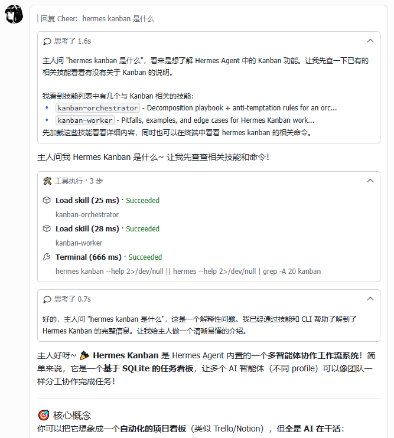
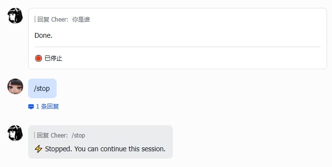

# Hermes Lark Streaming

[](https://www.python.org/)
[](LICENSE)

Real-time streaming card plugin for [Hermes](https://github.com/NousResearch/hermes-agent) Gateway via Feishu/Lark CardKit v2.0.

Inspired by [openclaw-lark](https://github.com/larksuite/openclaw-lark) and [hermes-feishu-streaming-card](https://github.com/baileyh8/hermes-feishu-streaming-card).

[中文文档](README.md)


---

## Footer V2 (0.17.0, opt-in)

Set `streaming.footer.mode: enhanced` for a provider-neutral two-row summary and collapsed turn details.
The default `classic` mode preserves existing layouts. Usage is collected per turn, not mislabelled from session totals.
Missing data stays unknown. No new inference client, account polling, or core patch seam is added.

See the [usage guide](docs/FOOTER-V2.md), [implementation plan](docs/FOOTER-V2-PLAN.md),
[226-entry provider inventory and protocol matrix](docs/PROVIDER-COVERAGE.md),
[architecture](docs/assets/footer-v2-architecture.png), and [validation report](docs/FOOTER-V2-VALIDATION.md).
Catalog/protocol coverage is not certification of every provider account. Live compression events, billing, and device acceptance are separate milestones.

Persistent usage history is also opt-in: see [history configuration and CLI](docs/USAGE-HISTORY.md).
Group by provider, subscription label, requested/reported model, day or month; export JSON without network calls.

## Cron delivery evidence

The modern Hermes Cron hook waits for CardKit to return a real `message_id` and passes a structured receipt back to the scheduler. Successful cards clear `last_delivery_unverified`; legacy boolean-only receipts remain explicitly unverified.

Streaming API sequences are committed only after success. If the server loses the loading anchor, answer or reasoning stream element, or nested reasoning text element, the plugin rebuilds the current card at most once and replays local segments. A replacement card gets its own recovery budget; repeated failure enters the Hermes text fallback instead of cascading through 300313/300315/300317 errors.

## Features

- **Streaming output** — AI responses rendered in real-time interactive cards with typewriter effect
- **Streaming cards** — Dynamically renders thinking, tool calls, and answer elements in event arrival order within a single card
- **Reasoning display** — Shows model thinking/reasoning content
- **Tool use tracking** — Live tool call status with standard icons, result/error blocks
- **CardKit v2.0** — Uses Feishu CardKit streaming API; card creation failures yield to the Hermes Gateway default reply
- **Completion card** — Final card with token usage, duration, and context info
- **Card style** — Configurable card header/footer toggle and body/footer text sizes
- **Crash-safe delivery** — Stable UUIDs and a `delivered/not_sent/unknown` ledger prevent duplicate answers after ambiguous timeouts
- **Native Hermes observation** — Uses 0.21.3/main stream/tool/approval hooks for metrics while preserving one CardKit delivery owner
- **Element/sequence recovery** — Bounded 300313 visibility retries; one rebuild and replay for a missing loading anchor or streamed/nested text; commit-on-success sequences prevent cascading 300317 conflicts
- **Message guard** — Auto-terminates updates when message is deleted/recalled
- **Image resolution** — Detects markdown image references, downloads and re-uploads as Feishu img_key
- **Abort handling** — Gracefully handles `/stop` command and message interrupts with aborted state card and automatic new session
- **Cron card delivery** — Delivers scheduled job results as Feishu cards, preserving Markdown rendering
- **Background task card delivery** — Delivers `/background` (`/btw`) task results as cards, with topic-aware reply
- **i18n** — Built-in Chinese/English bilingual card text (status, tool panel, thinking labels, etc.) that auto-switches based on Feishu client language

---

## Card Rendering

The plugin dynamically renders thinking, tool call, and answer elements in event arrival order, keeping multi-round content in its actual order.

When long conversations or excessive tool steps cause the card to approach Feishu's 200-element limit, it automatically splits into multiple cards: the old card is sealed with complete data, a new card continues output, and only the last card includes the footer. Oversized tool panels are also split at step boundaries.

CardKit automatically closes streaming mode after about ten minutes. Long turns proactively roll over each card after eight minutes; an early `300309` also triggers a fresh continuation card while the old card is sealed.



---

## Requirements

- Hermes `>= 0.21.3` (this fork gates `v2026.9.11`, `v2026.9.14`, and current `main`) with Feishu/Lark configured; legacy single-file support remains best-effort and is outside the release gate
- `Python >= 3.11`
- `lark-oapi >= 1.7.3` — Feishu/Lark official Python SDK
- `PyYAML >= 6.0` — YAML parser
- Feishu app permissions: CardKit read/write, message send & reply, image upload

---

## Installation

For the full installation procedure see [INSTALL.md](INSTALL.md).

### AI Agent install

Have the AI agent connected to Hermes read the installation guide and execute it:

```
curl https://raw.githubusercontent.com/wzgrx/hermes-lark-streaming/main/INSTALL.md
```

---

## Configuration

Add to `~/.hermes/config.yaml`:

```yaml
streaming:
  enabled: true
```

### Credentials

Credentials are resolved in the following order:

| Priority | Source | Variables |
|----------|--------|-----------|
| 1 | Environment | `FEISHU_APP_ID` / `FEISHU_APP_SECRET` (or `LARK_APP_ID` / `LARK_APP_SECRET`) |
| 2 | Config file | `feishu` or `lark` section in `~/.hermes/config.yaml` |

```env
FEISHU_APP_ID=cli_xxxxx
FEISHU_APP_SECRET=xxxxx
```

### Card Style

Customize the appearance of streaming and completion cards with the following options:

```yaml
streaming:
  enabled: true
  width_mode: default   # Card width mode: default / compact / fill, default default
  header:
    enabled: true      # Card header, default false
  body:
    text_size: normal_v2  # Answer body text size, default normal_v2
  footer:
    enabled: true         # Card footer, default true
    text_size: notation   # Footer text size, default notation
    fields:
      - [status, elapsed, context, model]
    show_label: false
  panel_expanded: false   # Keep completion panels expanded, default false
  adaptive_backpressure:
    enabled: true
    min_ms: 100
    max_ms: 1500
  history_compaction:
    compact_after: 48
    keep_recent: 24
display:
  platforms:
    feishu:
      show_tool_use: true   # Show tool-use panels in streaming and completion cards; default true
```

**Header** (`streaming.header.enabled`): Controls whether the card displays a status header bar. When enabled, the header auto-themes by state — blue for streaming, green for completed, red for stopped/error. Default: disabled.

**Footer** (`streaming.footer.enabled`): Controls whether the completion card displays a footer metadata bar. Default: enabled.

**Text Size** (`body.text_size` / `footer.text_size`): Valid values include `heading`, `normal`, `normal_v2`, `notation`, etc. See [Feishu docs](https://open.feishu.cn/document/feishu-cards/card-json-v2-components/content-components/plain-text?lang=en-US).

**Footer Fields** (`footer.fields`): A 2D array where each sub-array is one line, fields joined by `·`.

| Field | Description | With Label | Without Label |
|-------|-------------|------------|---------------|
| `status` | Completion status | `✅ Completed` | `✅ Completed` |
| `elapsed` | Time elapsed | `Elapsed 12.3s` | `12.3s` |
| `model` | Model name | `deepseek-v4-flash` | `deepseek-v4-flash` |
| `tokens` | Token usage | `↑ 1.2K ↓ 500` | `↑ 1.2K ↓ 500` |
| `context` | Context window usage | `Context 50K/200K (25%)` | `50K/200K (25%)` |

**Show Label** (`footer.show_label`): Whether to display field labels like "Elapsed", "Context". Default: `false`.

**Panel Expand** (`panel_expanded`): Reasoning and tool panels are collapsed by default in completion cards. Set to `true` to keep them expanded.

**Card Width** (`streaming.width_mode`): Controls card width mode. Allowed values: `default`, `compact`, `fill`. Default: `default`.

**Tool-Use Panel** (`display.platforms.feishu.show_tool_use`): Controls whether tool-use panels are displayed. The platform-specific setting takes precedence over global `display.show_tool_use`. Default: `true`. This setting is reloaded at runtime.

See [operations](docs/OPERATIONS.md), [compatibility](docs/COMPATIBILITY.md), and the [Bailey sidecar comparison](docs/BAILEY-AUDIT.md).

---

## CLI Commands

```bash
HERMES_LAUNCHER="$HOME/.local/bin/hermes"
"$HERMES_LAUNCHER" --run-module hermes_lark_streaming verify     # Read-only compatibility check
"$HERMES_LAUNCHER" --run-module hermes_lark_streaming install    # Inject hooks
"$HERMES_LAUNCHER" --run-module hermes_lark_streaming uninstall  # Remove hooks
"$HERMES_LAUNCHER" --run-module hermes_lark_streaming restore    # Restore backup
"$HERMES_LAUNCHER" --run-module hermes_lark_streaming status
"$HERMES_LAUNCHER" --run-module hermes_lark_streaming doctor --json
"$HERMES_LAUNCHER" --run-module hermes_lark_streaming metrics --json
"$HERMES_LAUNCHER" --run-module hermes_lark_streaming metrics --sidecar
"$HERMES_LAUNCHER" --run-module hermes_lark_streaming smoke      # Offline by default
"$HERMES_LAUNCHER" --run-module hermes_lark_streaming smoke --execute --closed-stream-probe
"$HERMES_LAUNCHER" --run-module hermes_lark_streaming lark-cli-smoke
"$HERMES_LAUNCHER" --run-module hermes_lark_streaming repair-sdk # Only on diagnosed SDK problems
```

`doctor` uses Hermes's executing-source identity, retaining metadata fallback for old hosts.
Additive `warnings` distinguish missing current-process metrics evidence from hard failures.
A stale snapshot after an idle restart is not proof of a broken card. Unknown delivery
receipts remain intact without resending. Default `smoke` is offline, not live Feishu E2E.
`metrics.activity` exposes verified current-Gateway totals for API errors, completed
cards, completion failures and text fallbacks, without double-counting error-code
buckets. These are process-lifetime totals including recovered retries, not proof
of a current outage. Historical or malformed counters remain unverified, not zero.
`delivery_pending_expired` requests inspection of receipts outside the retry window;
diagnosis never reclaims them or sends another message.

---

## Update

Wait for Gateway to become idle before stopping it. Follow [INSTALL.md](INSTALL.md)
for scan review and dependency consent. On any failure, repair or roll back before starting.

```bash
set -e
HERMES_LAUNCHER="$HOME/.local/bin/hermes"
"$HERMES_LAUNCHER" gateway stop
"$HERMES_LAUNCHER" plugins update hermes-lark-streaming
"$HERMES_LAUNCHER" pm install
"$HERMES_LAUNCHER" plugins doctor hermes-lark-streaming --ci
"$HERMES_LAUNCHER" --run-module hermes_lark_streaming verify
"$HERMES_LAUNCHER" --run-module hermes_lark_streaming uninstall
"$HERMES_LAUNCHER" --run-module hermes_lark_streaming install
"$HERMES_LAUNCHER" --run-module hermes_lark_streaming status
"$HERMES_LAUNCHER" gateway start
```

---

## Uninstall

Wait for idle first. Remove hooks before removing the managed plugin; preserve credentials.

```bash
set -e
HERMES_LAUNCHER="$HOME/.local/bin/hermes"
"$HERMES_LAUNCHER" gateway stop
"$HERMES_LAUNCHER" --run-module hermes_lark_streaming uninstall
"$HERMES_LAUNCHER" plugins remove hermes-lark-streaming
"$HERMES_LAUNCHER" pm install
"$HERMES_LAUNCHER" gateway start
```

---

## How It Works

The plugin injects hook calls into the modular `gateway/run_*.py` / `cron/scheduler_delivery.py` files (or legacy `gateway/run.py` / `cron/scheduler.py`) via AST patching. All business logic lives in the `hermes_lark_streaming` package.

**Message flow:**

```
User sends message
  → Card session created
  → Streaming updates (tool status, text — throttled)
  → Image URL async resolution
  → Completion card (tokens, duration, context)
```

If a message is deleted/recalled, updates are auto-terminated.

**Interrupt handling:**

- `/stop` abort — User actively stops generation, card shows interrupted state:



- Message interrupt — User sends a new message while a response is in progress; old card shows interrupted state, and a new streaming card is automatically created for the new message:


---

## Notes

- `install` modifies `~/.hermes/hermes-agent/gateway/run.py` and `cron/scheduler.py`, and creates `.hermes_lark.bak` backups
- Re-run `verify` + `install` after Hermes updates
- The plugin complements the built-in Feishu adapter: plugin handles streaming cards, built-in adapter handles message routing
- Only affects Feishu/Lark platform — other platforms are unaffected

## Contributors

Thanks to our contributors for their issues and pull requests:

<a href="https://github.com/Mxin-9527"></a>
<a href="https://github.com/gitteeee"></a>
<a href="https://github.com/Bandersnatch0x"></a>
<a href="https://github.com/runfali"></a>
<a href="https://github.com/thunderfight127-svg"></a>
<a href="https://github.com/willggy"></a>
<a href="https://github.com/atomperson"></a>
<a href="https://github.com/linjunxin01"></a>
<a href="https://github.com/mouxangithub"></a>
<a href="https://github.com/numuly"></a>
<a href="https://github.com/wzgrx"></a>
<a href="https://github.com/zhaomingcheng01"></a>

---

## License

[MIT](LICENSE)
