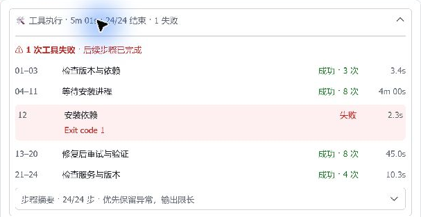
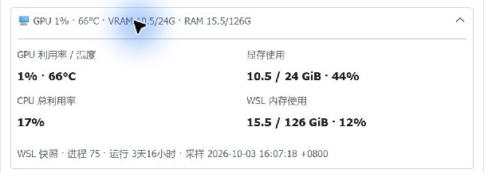
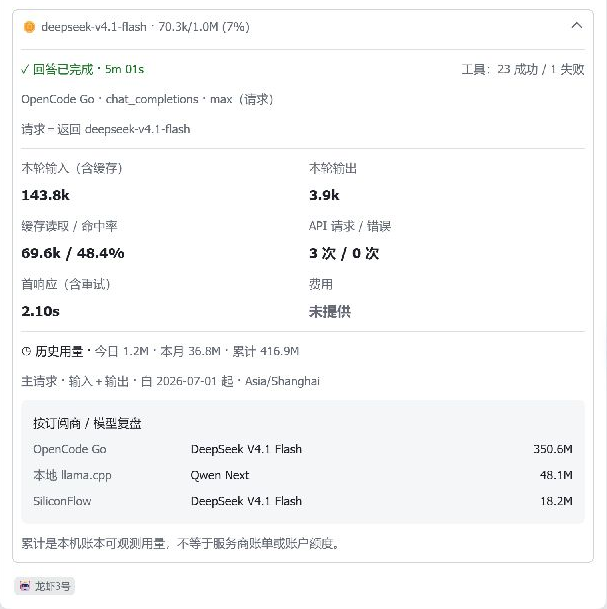
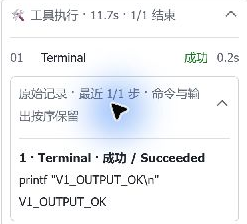
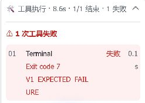
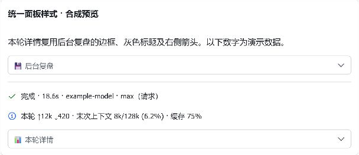
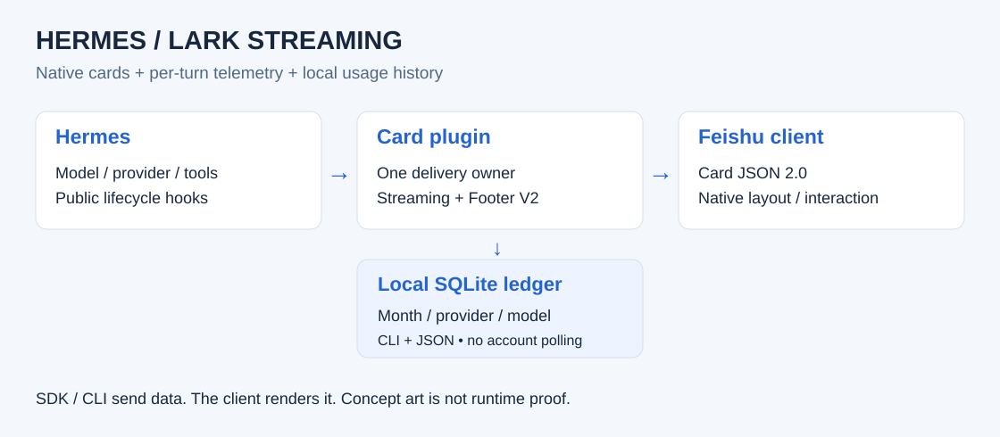
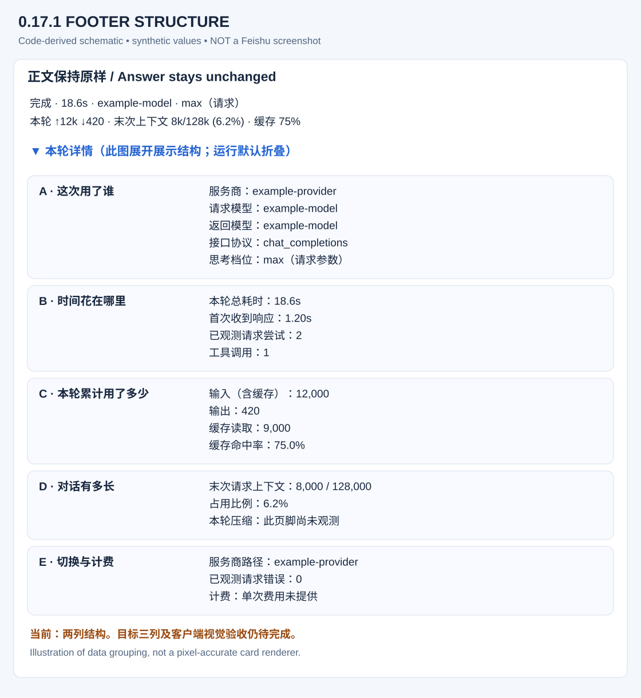
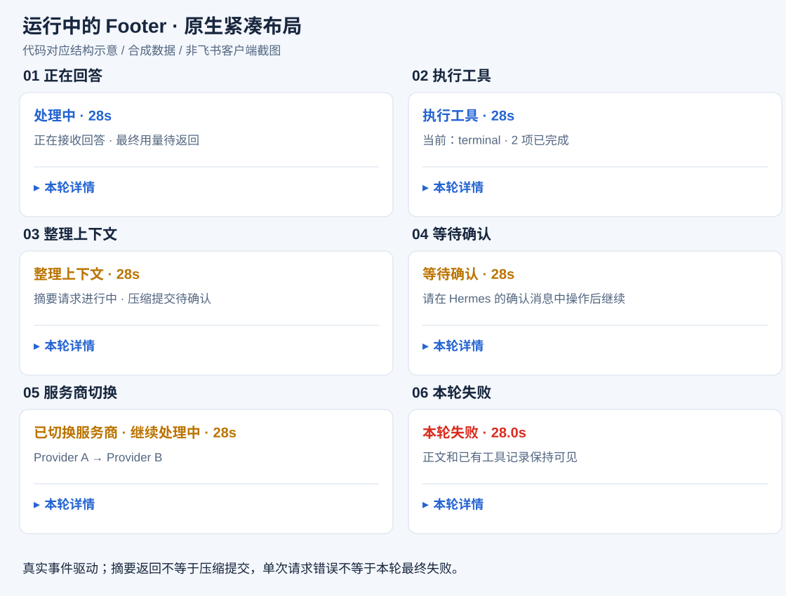

# Hermes Lark Streaming

> **0.20.24 · 2026-10-05**: incomplete Footer history uses observed lower bounds such as `≥1.9k*`, never rounding up the evidence. Missing usage stays `—*`; complete counts retain compact formatting. Subscription/model groups are explicitly cumulative top-three usage. Existing scope text explains the markers without adding panels or rows; V1 geometry, storage and dependencies are unchanged. [Scope and evidence](docs/MAINTENANCE-0224.md).


**Streaming Feishu/Lark cards, per-turn telemetry, and persistent usage history for Hermes.**

[](https://github.com/wzgrx/hermes-lark-streaming/actions/workflows/test.yml)

[](LICENSE)

[中文](README.md) · [Install](INSTALL.md) · [V1 design and evidence](docs/REFERENCE-V1.md) · [History](docs/USAGE-HISTORY.md)

> **Historical maintenance 0.20.16**: preserve lifecycle records beyond 128 tools while bounding old completed payload retention. Cheap counters avoid unnecessary full-history rendering. V1 geometry and payload gates stay unchanged. See [scope and verification](docs/MAINTENANCE-0216.md); historical screenshots are not new acceptance evidence.

> **0.20.4 desktop hardening:** fix dynamic tool panels, bounded missing-panel recovery, real-file configuration reload and first-response timing after retries. Compact history states retain the V1 native layout and single writer. Source, CI, server probe and deployment evidence are separate in [this audit](docs/DESKTOP-HARDENING.md).

> **Acceptance scope:** desktop Feishu only, per the operator. Mobile is out of scope, not a release blocker. Real-turn and desktop-theme evidence for 0.20.2 keeps its original version label; it is not pixel certification of this revision. See [V1 evidence](docs/REFERENCE-V1.md) and [changelog](CHANGELOG.md).

### V1 whole-card layout

**Tools → resource snapshot → answer → model/turn/history → identity tag**. Three native panels collapse by default; labels sit above paired values. Tool steps have four aligned columns, highlighted failures, and bounded adjacent poll merging. Opt in with `streaming.layout: reference`; legacy presentation remains the default.

These are **0.20.6 Windows Feishu screenshots of synthetic card content**, not production task data:





[Frozen design, configuration and remaining gates](docs/REFERENCE-V1.md) · [Actual-builder synthetic JSON](docs/assets/reference-v1-completed.json)

### 0.20.1 real tool completion fix

Hermes supplies completion results and errors through `result` / `is_error`, with an empty `preview`. The existing hook now consumes that metadata, preserves bounded terminal stdout, detects nonzero exit and removes sensitive values rather than merely appending a marker. These native client crops contain only real test-command markers, not private usage or chat identifiers.




Refresh generated hooks while Gateway is idle/stopped; see [INSTALL.md](INSTALL.md). Existing historical cards are not replayed or retroactively populated.

### Historical 0.19.2 panel-style revision

Turn details now reuse the **same native panel chrome as background review**, rather than a blue left-hand heading. Compact metrics and default collapse remain. Code/tests and the collapsed desktop preview pass. Managed 0.19.2 is deployed; Gateway and Feishu connection checks pass. Expanded/mobile acceptance remains separate.





## Scope

Hermes owns credentials, inference, routing, tools, and conversations. This plugin owns native CardKit delivery and observes public usage hooks. It is Hermes-only, not an OpenClaw plugin or a second model client.

- Stream answers, reasoning and tools in event order.
- Commit sequence numbers after success; retain stable UUIDs and delivered/not_sent/unknown receipts.
- Roll over long-running cards and preserve interruption, approval, cron and background boundaries.
- Enable Footer V2 for per-turn usage, cache, last-request context, timing and collapsed details.
- Store opt-in usage history in profile-local SQLite; query by model, provider, subscription label, day/month and timezone.
- Keep catalog coverage, protocol fixtures, server verification and real-client acceptance separate.
- Since 0.20.9, the standalone usage parser includes Cohere V2 physical tokens and cached-input counts, distinct from billed units. This is offline protocol coverage, not a new Hermes transport or live Cohere account certification. See [the coverage matrix](docs/PROVIDER-COVERAGE.md).

## Retained legacy footer structure

This section describes `layout: classic`, not the new V1 whole-card layout.



**This is a code-derived schematic with synthetic data, not a screenshot or a pixel-accurate Feishu renderer.**
The compact layout has two summary rows and about eight lines of details: metadata, four paired metric rows, context and notes. Different model IDs and multi-provider paths remain explicit. Unknown cost/compression stays unknown. Version 0.18.1 reads whitelisted scalar controls from public execution middleware using exact request identity; it neither parses truncated previews nor treats requested effort as server-confirmed effort.

[Synthetic Card JSON](docs/assets/footer-example.json) · [Rebuild assets](scripts/build_readme_assets.py)



Runtime phases use actual answer/tool/approval/API events. Summary completion is not compression commit; a request error is not final turn failure. See [runtime contracts and evidence](docs/FOOTER-RUNTIME.md).

## Managed setup

Read [INSTALL.md](INSTALL.md) for source review, dependency consent, exact revision updates and rollback.

```bash
hermes plugins install wzgrx/hermes-lark-streaming --enable --force
hermes pm install
hermes plugins doctor hermes-lark-streaming --ci
hermes --run-module hermes_lark_streaming verify
hermes --run-module hermes_lark_streaming install
```

The review flag is not a scanner disable switch. Use the durable Hermes launcher, not a legacy venv. Restart only in an idle maintenance window after verification.

Merge into existing configuration without replacing credentials or provider settings:

```yaml
streaming:
  enabled: true
  width_mode: default
  layout: reference
  agent_name: "Hermes"
  resources:
    enabled: true
  footer:
    enabled: true
    mode: enhanced
    details: true
    text_size: notation # Muted labels; V1 metric values retain normal_v2
    history:
      enabled: true
      timezone: Asia/Shanghai
      show_models: false
```

Repository defaults remain legacy layout, classic footer, resource snapshots and history disabled. History collection is independent of footer visibility. `layout: classic` restores the legacy whole-card layout; `show_models: true` adds the top three subscription/model groups to V1 details.
Requirements: Python ≥3.11, a compatible Hermes host, `lark-oapi >=1.7.3`, `PyYAML >=6.0.3`, and the required Feishu application permissions. See the [CI compatibility matrix](docs/COMPATIBILITY.md). Node SDK and CLI are optional, not runtime prerequisites.

## Historical usage

```bash
hermes --run-module hermes_lark_streaming history --timezone Asia/Shanghai
hermes --run-module hermes_lark_streaming history --month 2026-10 --timezone Asia/Shanghai --json
hermes --run-module hermes_lark_streaming history --group-by model --json
hermes --run-module hermes_lark_streaming history --scope auxiliary --json
```

The database is `$HERMES_HOME/state/card-usage.sqlite3`. Queries are read-only and make no model calls. Input includes cache; context is the last request, not turn totals. Provider/subscription labels are not verified account identities. Collection starts after enablement, stores no prompts or secrets, and is not an account-wide bill. Use SQLite's backup API for online snapshots; see [history details](docs/USAGE-HISTORY.md).

## Verification and open work

```bash
hermes --run-module hermes_lark_streaming doctor --json
hermes --run-module hermes_lark_streaming status
hermes --run-module hermes_lark_streaming metrics --json
hermes --run-module hermes_lark_streaming smoke
```

Default smoke is offline. Explicit `smoke --execute --closed-stream-probe` tests a real unattached CardKit entity; it is not a screenshot test.

Real-chat smoke now attempts to close owned entities after attach/stream errors, never automatically resends an ambiguous attachment, keeps primary and cleanup errors separate, and exits nonzero on failure. See [native acceptance and smoke maintenance](docs/MAINTENANCE-0217-LIVE-ACCEPTANCE.md).

Within an idle maintenance window, stop the Gateway gracefully before updating, then verify and start it:

```bash
hermes plugins update hermes-lark-streaming
hermes pm install
hermes --run-module hermes_lark_streaming verify
hermes --run-module hermes_lark_streaming install

# Only for an intentional uninstall, remove hooks before the managed plugin.
hermes --run-module hermes_lark_streaming uninstall
hermes plugins remove hermes-lark-streaming
hermes pm install
```

| Milestone | Status |
|---|---|
| Normalization, isolated turn collection, ledger, CLI reports | Implemented, automated tests pass |
| V1 0.20.1 managed deployment | Complete; idle restart, refreshed hooks/doctor/unchanged config/read-only ledger; real success and expected-failure turns pass |
| Managed 0.17.1 deployment and CardKit final update | Verified |
| Real desktop inspection | Old 0.17.1 mismatch confirmed; new compact synthetic preview inspected |
| Revised compact details | Implemented; synthetic desktop preview inspected; 0.19.2 deployed |
| Reliable reasoning-setting display in real requests | Offline contracts and real Gateway requested-max display pass; not proof of server acceptance |
| Live answer/tool/approval/summary/provider/error phases | Real answer/tool success/failure pass; approval/summary/provider-switch evidence remains contract/synthetic, not this probe's live coverage |
| Client visual matrix | Desktop widths, light/dark views and a real-clock eight-minute rollover inspected; mobile out of scope |
| Committed LCM compression telemetry, account quotas and billing | Pending reliable data sources |
| Historical-report buttons or web dashboard | Not implemented; CLI is available |
| Every account in the 226-entry provider catalog | Not certified |

**The whole plan is not complete.** Read [plan status](docs/FOOTER-V2-PLAN.md), [validation evidence](docs/FOOTER-V2-VALIDATION.md), and [roadmap](docs/ROADMAP.md).

## SDKs do not replace client rendering

The official [Node SDK](https://github.com/larksuite/node-sdk) and [CLI](https://github.com/larksuite/cli) submit Card JSON or expose operation/inspection tools. The Feishu client renders native components. Installing another sender does not implement a missing layout. Use the [official card builder](https://open.feishu.cn/tool/cardbuilder) and real-device comparisons; preserve a single Gateway delivery owner.

Image-based summaries preserve a fixed internal composition but lose native text/interaction; a web dashboard offers HTML/CSS control with extra hosting/access-control work. Neither is silently substituted for a native interactive footer. See the [source-linked design audit](docs/FOOTER-DESIGN-AUDIT.md).

## Development

Use an isolated development environment, not the live Gateway's PM generation.

```bash
python -m pip install -e ".[dev]"
python -m ruff check hermes_lark_streaming tests
python -m mypy --explicit-package-bases hermes_lark_streaming
python -m pytest tests -q
python scripts/build_readme_assets.py
```

[Operations](docs/OPERATIONS.md) · [Provider coverage](docs/PROVIDER-COVERAGE.md) · [Changelog](CHANGELOG.md) · [Contributors](README.md#贡献者)

Thanks to the upstream community and inspiration from [openclaw-lark](https://github.com/larksuite/openclaw-lark) and [hermes-feishu-streaming-card](https://github.com/baileyh8/hermes-feishu-streaming-card).

## License

[MIT](LICENSE)
