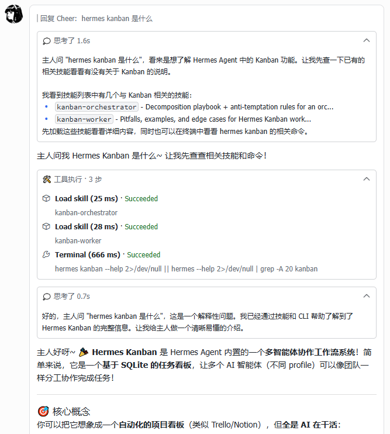
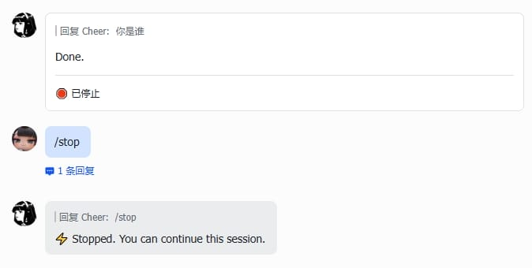
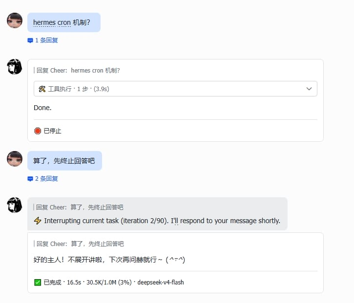

# Hermes Lark Streaming

[](https://www.python.org/)
[](LICENSE)

[Hermes](https://github.com/NousResearch/hermes-agent) Gateway 飞书流式卡片插件 — 基于 CardKit v2.0 的进程内流式消息卡片。

灵感来源于 [openclaw-lark](https://github.com/larksuite/openclaw-lark) 和 [hermes-feishu-streaming-card](https://github.com/baileyh8/hermes-feishu-streaming-card)。

[English](README.en.md)


---

## 功能

- **流式输出** — AI 回复实时显示在交互卡片中，打字机效果
- **线性模式** — 按事件顺序在单张卡片内动态渲染思考、工具调用、回答内容
- **思考过程** — 显示模型的推理/思考内容
- **工具调用** — 实时展示工具调用状态和进度，含标准图标和结果/错误块
- **CardKit v2.0** — 优先使用飞书 CardKit 流式 API，自动降级到 IM PATCH
- **终态卡片** — 完成后展示完整结果，含 token 用量、耗时、上下文信息
- **消息保护** — 消息被删除/撤回后自动终止更新，避免无效 API 调用
- **图片解析** — 自动识别 markdown 图片引用，下载上传后替换为飞书 img_key
- **中断处理** — 处理 `/stop` 命令和消息打断，展示中断状态卡片并自动开启新会话
- **多语言** — 卡片文本（状态、工具面板、思考标签等）内置中英双语，根据飞书客户端语言自动切换

---

## 运行要求

- Hermes `>= 0.11.0`（2026.4.23）已安装并配置飞书平台
- `Python >= 3.11`
- `lark-oapi >= 1.4.0` — 飞书/Lark 官方 Python SDK
- `PyYAML >= 6.0` — YAML 解析库
- 飞书应用权限：消息卡片（CardKit）读写、消息发送与回复、图片上传

---

## 安装

> **注意：** Hermes 运行在独立的 Python 虚拟环境中，请使用 Hermes 的 Python 安装插件，否则 gateway 启动后会无法加载。

### AI Agent

让 Agent 读取 README 后按手动步骤操作：

```
curl https://raw.githubusercontent.com/Cheerwhy/hermes-lark-streaming/main/README.md
```

### 手动安装

```bash
git clone https://github.com/Cheerwhy/hermes-lark-streaming.git
cd hermes-lark-streaming

# 安装到 Hermes 的 venv 中，确保 gateway 能加载插件
HERMES_PYTHON=~/.hermes/hermes-agent/venv/bin/python3
$HERMES_PYTHON -m pip install -e .
$HERMES_PYTHON -m hermes_lark_streaming verify   # 验证兼容性
$HERMES_PYTHON -m hermes_lark_streaming install   # 注入 hook
hermes gateway restart
```

---

## 配置

在 `~/.hermes/config.yaml` 中添加：

```yaml
streaming:
  enabled: true
  linear: true   # 可选：启用线性模式
```

### 凭据

凭据按以下顺序解析：

| 优先级 | 来源 | 变量 |
|--------|------|------|
| 1 | 环境变量 | `FEISHU_APP_ID` / `FEISHU_APP_SECRET`（或 `LARK_APP_ID` / `LARK_APP_SECRET`） |
| 2 | 配置文件 | `~/.hermes/config.yaml` 中的 `feishu` 或 `lark` 区段 |

```env
FEISHU_APP_ID=cli_xxxxx
FEISHU_APP_SECRET=xxxxx
```

### 页脚

通过 `streaming.footer` 自定义完成态卡片的页脚：

```yaml
streaming:
  enabled: true
  footer:
    fields:
      - [status, elapsed, context, model]
    show_label: false
```

**字段**（`footer.fields`）：二维数组，每个子数组为一行，字段间用 `·` 连接。

| 字段 | 说明 | 有标签 | 无标签 |
|------|------|--------|--------|
| `status` | 完成状态 | `✅ Completed` | `✅ Completed` |
| `elapsed` | 耗时 | `Elapsed 12.3s` | `12.3s` |
| `model` | 模型名称 | `deepseek-v4-flash` | `deepseek-v4-flash` |
| `tokens` | Token 用量 | `↑ 1.2K ↓ 500` | `↑ 1.2K ↓ 500` |
| `context` | 上下文窗口用量 | `Context 50K/200K (25%)` | `50K/200K (25%)` |

**显示标签**（`footer.show_label`）：是否展示字段标签（如 "Elapsed"、"Context"）。默认：`false`。

未配置时的默认值：`fields: [[status, elapsed, context, model]]`，`show_label: false`。

### 线性模式

启用后，插件按事件到达顺序在卡片内动态渲染思考、工具调用、回答元素，推理和工具调用不再收纳置顶，多轮对话内容按实际顺序展示。

```yaml
streaming:
  enabled: true
  linear: true
```



---

## CLI 命令

```bash
HERMES_PYTHON=~/.hermes/hermes-agent/venv/bin/python3
$HERMES_PYTHON -m hermes_lark_streaming verify     # 验证兼容性（不修改文件）
$HERMES_PYTHON -m hermes_lark_streaming install    # 注入 hook
$HERMES_PYTHON -m hermes_lark_streaming uninstall  # 移除 hook
$HERMES_PYTHON -m hermes_lark_streaming restore    # 从备份恢复原始 run.py
$HERMES_PYTHON -m hermes_lark_streaming status     # 查看状态
```

---

## 更新

```bash
cd hermes-lark-streaming
git pull
HERMES_PYTHON=~/.hermes/hermes-agent/venv/bin/python3
$HERMES_PYTHON -m pip install -e .
$HERMES_PYTHON -m hermes_lark_streaming uninstall   # 先移除旧注入
$HERMES_PYTHON -m hermes_lark_streaming verify
$HERMES_PYTHON -m hermes_lark_streaming install
hermes gateway restart
```

---

## 卸载

```bash
HERMES_PYTHON=~/.hermes/hermes-agent/venv/bin/python3
$HERMES_PYTHON -m hermes_lark_streaming uninstall
$HERMES_PYTHON -m pip uninstall hermes-lark-streaming
```

---

## 工作原理

插件通过 AST 注入在 `gateway/run.py` 的 **8 个位置**插入 hook 调用，所有业务逻辑在 `hermes_lark_streaming` 包内完成：

| Hook | 注入位置 | 说明 |
|------|----------|------|
| `on_message_started` | `_handle_message_with_agent` 函数体开头 | 创建卡片会话，发送占位卡片 |
| `on_tool_updated` | `progress_callback` 内部 | 实时展示工具调用状态 |
| `on_answer_delta` | `_stream_delta_cb` 内部 | 流式更新回答文本 |
| `on_thinking_delta` | `_interim_assistant_cb` 内部 | 显示思考/推理过程 |
| `on_reasoning_delta` | `agent.reasoning_config` 赋值之后 | 流式展示模型原生推理 |
| `on_message_aborted` | stale `return None` 之前 | 处理 `/stop` 中断 |
| `on_message_interrupted` | `_run_agent` 递归调用前 | 处理消息打断，终止旧卡片并创建新会话 |
| `on_message_completed` | `return response` 之前 | 发送终态卡片 |

**消息处理流程：**

```
用户发送消息
  → 创建卡片会话
  → 流式更新（工具状态、文本增量 — 节流调度）
  → 图片 URL 异步解析替换
  → 终态卡片（token/耗时/上下文）
```

若消息被删除/撤回，UnavailableGuard 自动终止后续更新。

**中断处理：**

- `/stop` 终止 — 用户主动停止，卡片展示中断状态：



- 消息打断 — 用户发送新消息打断正在处理的回复，旧卡片展示中断状态，并自动为新消息创建新的流式卡片：



**降级策略：**

| 策略 | 间隔 | 触发条件 |
|------|------|----------|
| CardKit 流式（优先） | 100ms | 默认 |
| IM PATCH（降级） | 1.5s | CardKit 创建失败、表格超限等 |
| 速率限制 | — | 跳过当前帧，不降级通道 |
| 终态卡片失败 | — | Gateway 回退到默认文本回复 |

---

## 注意事项

- `install` 会修改 `~/.hermes/hermes-agent/gateway/run.py`，自动创建 `.hermes_lark.bak` 备份
- Hermes 更新后需重新运行 `verify` + `install`
- 插件与 Hermes 内置飞书适配器互补工作：插件负责流式卡片，内置适配器负责消息收发
- 仅对飞书平台生效，其他平台不受影响

## 贡献者

感谢以下贡献者的 Issue 和 PR：

<a href="https://github.com/Mxin-9527"></a>
<a href="https://github.com/gitteeee"></a>
<a href="https://github.com/Bandersnatch0x"></a>

---

## 许可证

[MIT](LICENSE)
