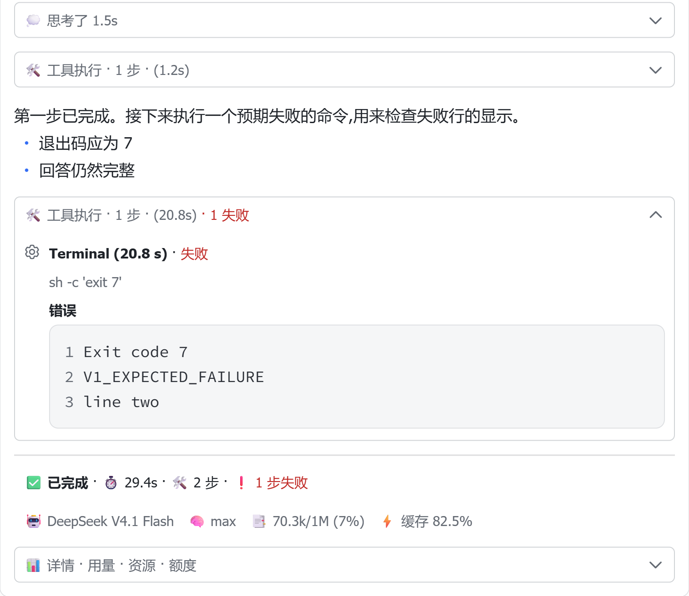

# Hermes Lark Streaming

让 Hermes 的飞书回复成为一张持续更新的卡片:思考、工具、回答按发生顺序排列,最后一行状态页脚。

[安装](INSTALL.md) · [v1 设计稿(历史)](docs/design/card-redesign.html) · [架构](docs/ARCHITECTURE.md) · [更新记录](CHANGELOG.md)

> 1.0 是完全重写。旧版(0.21.x)的三套布局合并为一套,配置键同步精简,旧配置不兼容,迁移见 [升级说明](docs/MIGRATION.md)。

## 卡片长什么样

沿用原项目最初的样式:没有标题栏,内容按发生顺序排列,最后一条分隔线和一行状态页脚。下面是飞书桌面端真实截图(测试群里的模拟对话):

| 运行中 | 已完成 | 有工具失败 |
|---|---|---|
|  |  |  |

- **时间线**:`💭 思考了 1.6s` 面板、`🛠️ 工具执行 · N 步 · (耗时)` 面板(每个工具一行:图标、**名称 (耗时)** · 成功/失败,下面一行灰色命令)、回答文字,按实际发生顺序交替出现。
- **运行中**:面板展开,回答逐字输出,底部一行 `⏳ 正在执行 Terminal · 步骤 2/3 · 12s`。
- **完成后**:面板折叠;有失败的工具面板保持展开,标红并给出错误输出。
- **页脚**两行:`✅ 已完成 · ⏱️ 2m 01s · 🛠️ 2 步`(有失败时加 `❗ N 步失败`),下一行灰色 `🤖 模型 · 📑 403.7k/1M (40%) · ⚡ 缓存 100% · 🧠 max`。停止为 `🛑 已停止`,出错为红色 `❌ 出错`。
- **详情**:页脚下方一个折叠的 `📊 详情` 面板,横向紧凑排布:📊 本轮(↑ 输入、↓ 输出、缓存、首响应、思考强度,配置单价后还有 💸 费用)、🪙 累计(今日、本月、总计)、🖥️ 资源(CPU、GPU 与温度、显存、内存、磁盘)各占一行;订阅额度 ⏱️ 5 小时 / 📅 每周 / 🗓️ 每月,每个窗口一行进度条和重置时间(≥50% 橙色、≥80% 红色);以及后台复盘。各分区独立开关,缺失的数据不显示。

## 能力

- 流式更新、10 分钟窗口前自动换卡(旧卡封存为“已分页”)。
- 可靠投递:成功后才提交序号,稳定 UUID,投递三态台账;结果不明不会重复发送答案。
- 打断、`/stop`、排队后续、审批与 clarify 边界、后台任务、Cron 结果都以卡片呈现。
- 消息被删除或撤回后自动停止更新;创建失败时交还 Hermes 默认回复。
- 工具参数、错误与输出一律先脱敏再转义;只读采集,不开后台进程,不自动换号。

## 配置

写在 Hermes 的 `config.yaml` 中:

```yaml
streaming:
  enabled: true
  text_size: normal_v2      # 正文字号
  width_mode: default       # default | compact | fill
  process: auto             # auto | open | closed | off
  agent_name: ""            # 底栏身份标签,留空则不显示
  details:
    usage: true
    resources: false
    timezone: Asia/Shanghai
    accounts:
      enabled: false
      allowed_chats: []     # 账户额度必须显式列出会话
```

其余键见 [配置参考](docs/CONFIG.md)。Hermes 自带的 `display.show_reasoning`、`display.show_tool_use` 仍然生效。

## 运行要求

Hermes ≥ 0.21.3(模块化网关布局),Python ≥ 3.11,飞书应用具备 CardKit、消息收发与图片权限。凭据沿用 Hermes 现有配置,不额外保存。

## 开发

```bash
python -m venv .venv && .venv/bin/pip install -e ".[dev]"
.venv/bin/python -m pytest tests -q
.venv/bin/ruff check hermes_lark_streaming tests
.venv/bin/mypy --explicit-package-bases hermes_lark_streaming
```

## 许可

MIT。灵感来自 [Cheerwhy/hermes-lark-streaming](https://github.com/Cheerwhy/hermes-lark-streaming)、[openclaw-lark](https://github.com/larksuite/openclaw-lark) 与 [hermes-feishu-streaming-card](https://github.com/baileyh8/hermes-feishu-streaming-card)。
