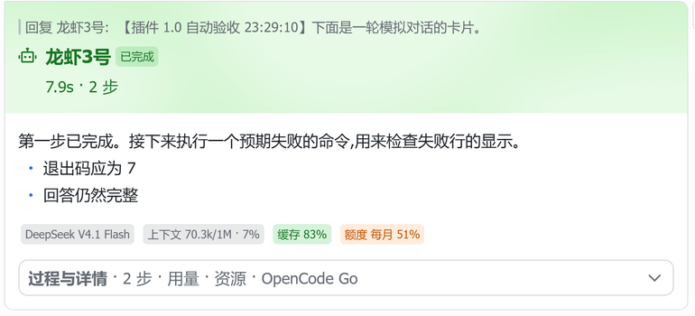
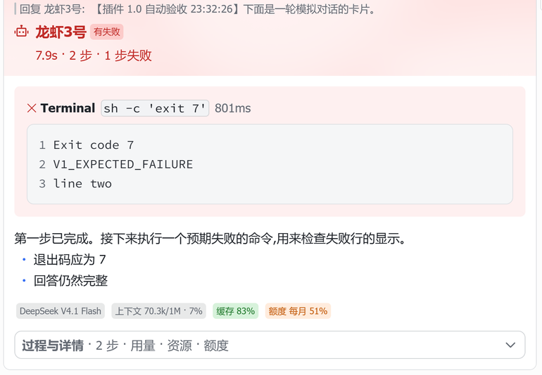

# Hermes Lark Streaming

让 Hermes 的飞书回复成为一张持续更新的卡片:彩色标题栏表示状态,回答为主体,过程与详情收进一个折叠面板。

[安装](INSTALL.md) · [v1 设计稿(历史)](docs/design/card-redesign.html) · [架构](docs/ARCHITECTURE.md) · [更新记录](CHANGELOG.md)

> 1.0 是完全重写。旧版(0.21.x)的三套布局合并为一套,配置键同步精简,旧配置不兼容,迁移见 [升级说明](docs/MIGRATION.md)。

## 卡片长什么样(v2)

飞书桌面端真实截图(测试群里的模拟对话):

| 运行中 | 已完成 | 有工具失败 |
|---|---|---|
|  |  |  |


| 状态 | 标题栏 | 正文 |
|---|---|---|
| 运行中 | 蓝色 · 运行中 | 一行实时状态(正在执行的命令、步骤计数、计时),下面是流式回答 |
| 已完成 | 绿色 · 已完成 · 耗时 · 步数 | 回答 → 一行彩色信息条 → 折叠的“过程与详情” |
| 有工具失败 | 红色 · 有失败 · 失败步数 | 失败步骤置顶(命令、耗时、输出代码块),其余同上 |
| 本轮失败 / 已停止 / 已分页 | 红 / 灰 / 灰 | 回答或说明 |

- **信息条**:模型、上下文占比(≥60% 橙、≥85% 红)、缓存命中(≥50% 绿),额度窗口达到 50% 才出现(≥80% 红)。
- **过程与详情**:默认折叠,收拢步骤、思考、用量(本轮与历史累计)、资源(GPU/显存/内存/磁盘)、订阅额度进度条和后台复盘。用量、资源、额度各自独立开关。
- 缺失的数据不显示,也不补造;一个分区什么都没有时整块省略。
- 面板使用每张卡片独立的 id,飞书不会把上一张卡片的展开状态带过来。

## 能力

- 流式更新、10 分钟窗口前自动换卡(旧卡封存为“已分页”)。
- 可靠投递:成功后才提交序号,稳定 UUID,投递三态台账;结果不明不会重复发送答案。
- 打断、`/stop`、排队后续、审批与 clarify 边界、后台任务、Cron 结果都以卡片呈现。
- 消息被删除或撤回后自动停止更新;创建失败时交还 Hermes 默认回复。
- 工具参数、错误与输出一律先脱敏再转义;只读采集,不开后台进程,不自动换号。

## 配置

写在 Hermes 的 `config.yaml` 中:

```yaml
streaming:
  enabled: true
  text_size: normal_v2      # 正文字号
  width_mode: default       # default | compact | fill
  process: auto             # auto | open | closed | off
  agent_name: ""            # 底栏身份标签,留空则不显示
  details:
    usage: true
    resources: false
    timezone: Asia/Shanghai
    accounts:
      enabled: false
      allowed_chats: []     # 账户额度必须显式列出会话
```

其余键见 [配置参考](docs/CONFIG.md)。Hermes 自带的 `display.show_reasoning`、`display.show_tool_use` 仍然生效。

## 运行要求

Hermes ≥ 0.21.3(模块化网关布局),Python ≥ 3.11,飞书应用具备 CardKit、消息收发与图片权限。凭据沿用 Hermes 现有配置,不额外保存。

## 开发

```bash
python -m venv .venv && .venv/bin/pip install -e ".[dev]"
.venv/bin/python -m pytest tests -q
.venv/bin/ruff check hermes_lark_streaming tests
.venv/bin/mypy --explicit-package-bases hermes_lark_streaming
```

## 许可

MIT。灵感来自 [Cheerwhy/hermes-lark-streaming](https://github.com/Cheerwhy/hermes-lark-streaming)、[openclaw-lark](https://github.com/larksuite/openclaw-lark) 与 [hermes-feishu-streaming-card](https://github.com/baileyh8/hermes-feishu-streaming-card)。
