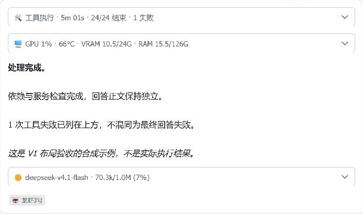
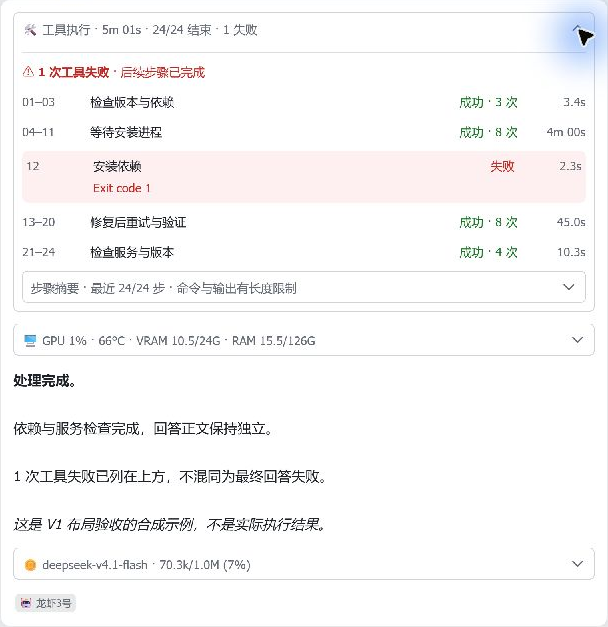
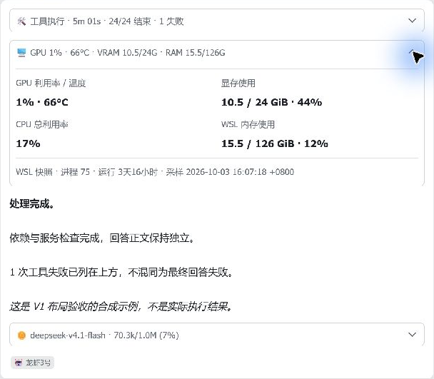
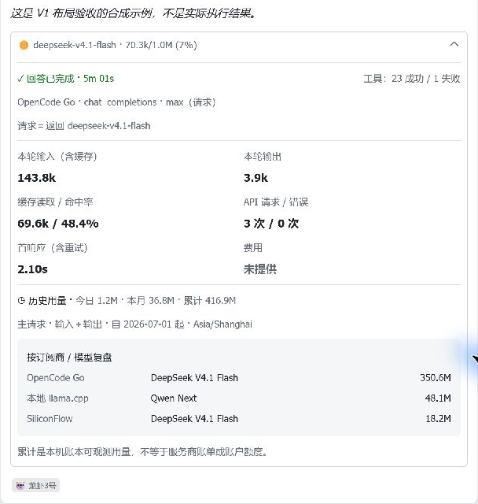

# 0.20.4 桌面验收与交付范围

验收时间：2026-10-03 UTC。代码：`847ba0f42e2905d6431f9d1b83b70f45fb978c15`。

本次仅更新既有测试话题中的**合成预览卡片**，然后在 Windows 飞书中展开核对。
没有发送新消息、调用模型、修改真实回复、写入生产用量或再次重启 Gateway。
下列截图只裁出合成卡片，不包含聊天列表和生产用量；示例数字不是设备实时状态。

## 当前版本实拍

### 默认折叠

保留工具、资源、正文、模型/用量、身份标签的顺序。三个面板独立折叠，正文不包在统计面板里。

### 工具展开

四列对齐；失败行单独着色，后续成功不会擦掉失败。
`24/24 结束`不是`24/24 成功`，回答完成也不是工具全成功。
下层入口使用“步骤摘要”，明确最近步数和文本长度限制，而非声称是完整原始日志。

### 资源展开

标签在上、数值在下；展开明细使用 GiB，标明 WSL 范围和采样时间。
这是一次快照，不是持续刷新的主机监控；折叠标题仍使用短单位 G 以节省宽度。

### 本轮与历史展开

保留服务商、接口、请求思考强度、请求/返回模型、输入含缓存、输出、缓存命中、
API 请求/错误及“首响应（含重试）”。缺失费用明确显示“未提供”，不是零费用。
历史显示今日/月/累计、启用起点、时区和订阅商/模型分组，说明本机账本不是供应商账单。

## 证据分层

| 层级 | 本次结论 | 边界 |
|---|---|---|
| 源码与自动测试 | 1482 项、Ruff、mypy、离线 wheel 已通过 | 见 [修复记录](DESKTOP-HARDENING.md)，不是视觉证据 |
| GitHub | 精确代码 Tests / CodeQL 通过，用户 main 已发布 | 文档提交不要求重新部署 |
| CardKit API | 既有合成实体更新成功 | 消息读取接口返回旧客户端提示占位，未据此判断 UI 成败 |
| 桌面客户端 | 1536×912 窗口，浅色；折叠/工具/资源/Footer 展开可读 | 原生界面实拍，不是网页模拟或重画 |
| 运行环境 | 托管 0.20.4，Gateway running、飞书 connected、doctor 检查及只读数据库健康通过 | 保留 metrics_stale / delivery_unknown 提醒，不删除旧证据 |
| 新版真实模型轮次 | 本次未发起 | 0.20.1/0.20.2 的真实工具与账本测试仍保留原版号 |
| 逐像素相同 | 未作此认证 | 冻结 SVG 保持不变；原生字号、客户端缩放与画布像素并不等同 |
| 手机 | 用户明确排除 | 不是当前交付阻塞项 |

[机器可读验收范围与图片哈希](assets/desktop-0204-client-checks.json) ·
[部署证据](assets/desktop-hardening-deployment-checks.json)

## 计划核对

- 已交付：研究目录、接口矩阵、任务计划、架构与五张冻结 V1 图、新卡片代码、
  历史用量、测试、用户 main 发布及托管部署。
- 226 个目录入口及 45 个 Hermes 静态配置走统一采集/显示路径；Hermes canonical
  与六类协议有测试。目录覆盖、协议测试与真实账号验证分别记录，
  不将这些数字解释为全球提供商总数或逐账号联网验证。
- 复核 models.dev 固定提交时，新增 `teamorouter` 目录只有 logo，尚无提供商定义；
  根目录 logo 也不是提供商，因此没有把目录项数量膨胀为适配数量。
- 本轮结束代码扩展；账户余额、真实费用、全新仪表盘等独立功能不插入本轮。
  剩余证据边界就是上表，不以反复修改设计基准来制造“完全一致”。

[详细计划](FOOTER-V2-PLAN.md) · [提供商覆盖](PROVIDER-COVERAGE.md) ·
[冻结 V1 与历史验收](REFERENCE-V1.md)
