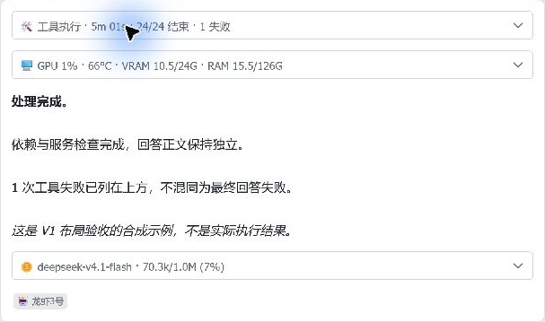

# 0.20.6 原生桌面卡片核对

日期：2026-10-04；代码：`d2dd2dbf5521da7ecc37c2f2bb67c6a3ca191e4d`。
当前 builder 生成 JSON，更新既有合成预览，随后在 Windows 飞书实拍。
只裁卡片区域；数字是固定示例，不是主机实时值或生产账本。
没有发送用户消息、调用模型、重启 Gateway 或改写真正的历史回复。

## 默认折叠

工具、资源、模型/用量三个面板独立开合，正文和身份标签不放进统计容器。

## 工具展开

四列按步骤、说明、状态、耗时排列；失败保留浅红底。
显示 `24/24 结束` 与 `1 失败`，不把所有结束步骤称为成功。
下层入口为“步骤摘要 · 优先保留异常，输出限长”，与当前实现一致。

## 资源展开

标签上、数值下，两列排列；GiB、WSL 范围和快照采样时间可见。

## 本轮与历史展开

保留服务/接口/请求思考强度、请求和返回模型、输入含缓存、输出、缓存率、
请求/错误、含重试首响应、未知费用，以及今日/月/累计与订阅商/模型分组。
数字与对应固定 fixture 一致，不把合成数据写入生产账本。

## 证据界限

| 项目 | 结论 |
| --- | --- |
| 当前 JSON 与 CardKit 接受 | 已验证，保留哈希和私有原消息回执 |
| 原生桌面展开与折叠 | 已观察；浅色，961×731 / 1536×912 窗口 |
| 当前新增缓存边界 | 八项自动回归；上图是普通完整用量示例，不声称逐场景实拍 |
| Gateway/飞书与本机数据库 | 见独立维护部署记录；不是模型整轮证据 |
| 0.20.6 真实用户消息整轮 | 尚未发起；操作前确认待用户回复 |
| 冻结 V1 SVG 逐像素一致 | 未认证；原生字体、行高和客户端缩放仍有差异，保留基准原件 |
| 手机 | 用户已排除 |

截图仅做边界裁剪，未重绘文字或替换内容。指针/点击提示属于采集画面。
历史 0.20.4 截图与实测记录继续保留，不覆盖为新版。

[机器可读记录及图片哈希](assets/desktop-0206-client-checks.json) ·
[部署与回归](MAINTENANCE-0206.md) · [五张冻结设计图](REFERENCE-V1.md) ·
[提供商与接口覆盖](PROVIDER-COVERAGE.md)
