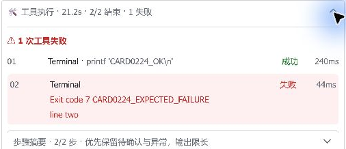

# 0.20.24 — 真实聊天与桌面截图验收

日期：2026-10-05（Asia/Shanghai）。本轮针对已部署提交
`50882ceb40c7eaed54e2f94408a0e0449e909352`，不是旧卡片重看或合成 API 探针。
使用正在运行的 Hermes 与 PM 依赖；不创建第二套 Hermes，不改配置，不重启 Gateway。

## 真实回合

通过已登录的 Windows 飞书，在既有 V1 测试话题只发送一条请求。
要求逐次执行两次终端调用：输出测试标记，随后输出另一标记并预期退出 7；
不读写文件/配置/记忆，不重试或修复预期失败。

| 层级 | 实际证据 |
|---|---|
| 用户入站 | 只读 `state.db` 找到唯一的新测试请求，属于原飞书话题会话 |
| 模型 | 3 条完成的主请求，OpenCode Go / deepseek-v4.1-flash；`max` 标为请求值，不推测服务端实际强度 |
| 工具 | 正好 2 次 `terminal`，调用与结果 ID 一一匹配，退出码 0 / 7，两段 stdout 标记匹配 |
| 回答 | 最终准确回复“验收完成：成功1次，预期失败1次。”；工具失败不误标为回答失败 |
| 传输 | 1 次建卡、1 次话题卡片投递、6 次批量更新、1 次元素流式更新、1 次关流、1 次最终更新，均成功 |
| 当前进程 | 指标 PID 与 Gateway 一致，完成后空闲；范围内无 traceback / history-record failure / footer observer skipped |
| 用量 | 3 个唯一完成主事件；本轮输入/输出和 API 次数与展开 Footer 一致；缓存部分统计保持下限，费用未提供不显示假零 |

整个回合约 21.2 秒。没有新增第二个写卡者或重复纯文本回答。

## Windows 视觉与操作

- 窄话题栏：原生折叠标题自动换行，摘要和正文可读。
- 将原生话题栏拉宽至约 600 逻辑像素（卡片约 524）：四列工具行、失败浅红底、错误两行与独立耗时可读。
- 分别展开工具、步骤摘录、资源和 Footer。成功 stdout、失败退出码 7/两行输出可读。
- 资源双列包含 GPU/温度、显存、CPU、WSL 内存；底部标明采样时间/WSL 范围，是本轮快照而非持续监控。
- Footer 保留回答已完成/工具成功失败分列、provider/请求与返回模型、max（请求）、双列统计及历史口径。
- 保留原 V1 工具→资源→回答→模型/用量→身份标签顺序，没有为了截图把整卡改成图片。



此公开截图只包含本轮受控测试命令、状态与耗时；资源/Footer 实图含本机用量，
完整截图和卡片局部图仅保留本机，不上传聊天列表、生产历史数值、消息标识或日志。
未测深色/不同缩放矩阵、长回合插话/压缩/过期续卡；不将本次短回合等同于这些复杂场景。

## 发现并完善的验收逻辑

本轮 `im.message.get` 成功返回 `interactive`，但 `body.content` 仅含
“请升级至最新版本客户端，以查看内容”的兼容投影。**桌面同一消息实际已正常渲染**。
因此正文里搜不到标记不应直接判成 Gateway 丢内容或要求用户升级客户端；
该 API 读取只证明消息存在与类型，正文/数字核对改用当前卡片可访问文本、截图和只读本机记录。
这是一条实际观察，不推断所有 CardKit 消息都必然返回相同投影。

新增标准库工具 `scripts/audit_real_gateway.py`，只核对已保存的私有证据，
检查调用/结果关联、退出码、stdout、唯一用量事件、投递、当前 PID、配置保留和空闲状态。
不执行聊天/模型/网络请求，不输出 prompt、token、消息 ID、账户或原始异常路径。
API 投影可读性与快照一致性分开；工具始终不自行宣称桌面像素验收通过。

```bash
python3 scripts/audit_real_gateway.py "$PRIVATE_EVIDENCE_DIR" \
  --success-marker CARD0224_OK --failure-marker CARD0224_EXPECTED_FAILURE \
  --answer '验收完成：成功1次，预期失败1次。'
```

目录输入为 `db-turn-private.json`、`new-history.json`、`new-delivery.json`、
`observation.json`、`message.json`。这些都是操作者采集的快照，不是自动刷新或不可伪造的签名；
报告明确 `snapshot_consistency_only: true`，不会将合成单元测试冒充新的真实验收。

本轮没有复现新的 V1 渲染/投递故障，因此不为凑版本重写正常的 renderer、hook、依赖或数据库。
验收工具和文档为维护更新，包版本仍为 0.20.24，无需为此重启 Gateway。
