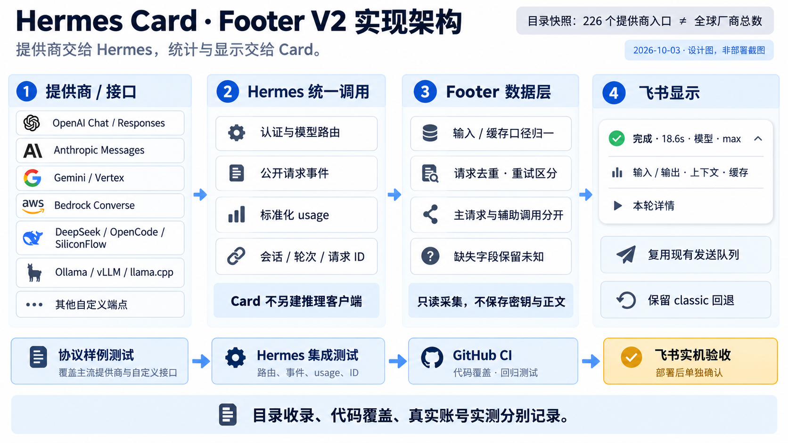

# Footer V2（Hermes 专用）

历史用量另见 [持久化、月报与订阅统计](USAGE-HISTORY.md)。账本与单轮 footer 独立，可按需启用。

> 2026-10-03：源码 0.18.0 使用[紧凑详情](FOOTER-COMPACT.md)，取代旧五组长表。合成卡片 API 和桌面展开检查通过；托管运行仍为 0.17.1，部署与移动/深色/运行态验收单列。

## 开启与回退

在已有 Hermes 配置中合并以下字段，不要覆盖整个文件：

```yaml
streaming:
  footer:
    enabled: true
    mode: enhanced
    details: true
    text_size: normal
```

新模块默认仍为 `classic`，避免升级时改变现有字段布局；`mode: classic` 回退，`enabled: false` 隐藏。
enhanced 使用带状态图标的两行摘要及左侧展开入口。详情包含模型元数据、四行双列指标、末次上下文与说明；间距 4px，相同请求/返回模型合并显示，差异或切换单列。正文不变。字段和值在同一指标单元内换行，避免平行多行文本串位；旧 `fields` / `show_label` 仅在 classic 生效。
插件代码更新需按 [INSTALL.md](../INSTALL.md) 使用托管安装与依赖同步，再重启 Gateway 加载 PM 新快照。仅修改源码 checkout 不会改变运行中的插件。

## 已实现

- 本轮墙钟耗时、请求/返回模型、实际请求中的思考参数（标注“请求”，不是服务端采用确认）。
- 主请求输入总量（含缓存）、输出、末次上下文与有效上限。
- 有可靠证据的缓存率、首个响应块延迟、已观测请求次数、工具数、错误次数和服务商路径。
- 中英文原生折叠详情；摘要省略未知数值，详情保留稳定字段位置并标注“未提供”；统计缺损明确标注。
- public `pre_api_request` / `post_api_request` / `api_request_error` 采集，不新增核心 AST 注入点。
- 226 个目录入口及自定义名称共用 canonical 路径。独立 usage parser 同时覆盖 Chat/Responses/Anthropic/Gemini/Bedrock/Ollama 语义；不创建新的推理客户端。

## 统计边界

Hermes 的最终结果包含会话累计计数；enhanced 不拿它伪装本轮累计，而是采集当前 turn 的请求事件。
第一次 post 没有匹配 pre 时丢弃；跨 profile/session/turn 事件不猜归属，终态后不重新打开。
每个逻辑请求的重复回调按请求 ID 与 started_at 去重；真正重试的不同尝试分别计数。
请求错误数不等于额外收费次数，未知失败 usage 不估算。

当前 Hermes 把缺失缓存桶也归一化为 0，回调不保留原始字段存在性；collector 保守地只在每个已计请求都有正值缓存证据时显示整轮命中率。
这会隐藏部分真实 0% 场景，但不会把未知写成 0%。纯协议 parser 仍能区分 API 明确报告的 0 与缺失。

卡片上下文不是“还可输出 token”；切换后使用末次请求报告的 context_length，不按模型名字猜上限。
LCM 中途更换存储 session 的同轮事件若缺少明确身份映射，会让统计显示不完整，而非拼接“最近会话”。
主请求之外的压缩/标题/子代理消费不混入本轮；费用、账户额度不推算。

## 尚待事件与实机验收

此前状态设计图中的实时压缩阶段/已提交压缩前后大小、可追踪账户账单等未在本次里程碑实现；仍沿用现有运行中 loading/工具/审批 UI。
不会根据一次辅助摘要 API 完成就宣布压缩完成。
未知/旧 Hermes 缺少公开 hooks 时基础模型/耗时可显示，详细统计明确待采集。

本轮协议与集成 fixture 是离线回归，不是 226 家账号实测。桌面/手机折叠、真实 provider 回包、连续多轮和长任务换卡应在部署后单独验收。

`smoke --execute --closed-stream-probe` 现使用配置中的 footer 模式验证真实 CardKit 全量更新，不再只测经典样式。没有模型请求的 smoke 明确展示统计待采集，也不写入历史账本。
运行指标包含 `footer.event.accepted/rejected`、`footer.skip.context/session`、`footer.turn.measured/missing`，便于区分历史账本成功与当前卡片采集成功；不存储对话正文或身份标签。

## 设计与来源

- [任务计划](FOOTER-V2-PLAN.md)
- [完整提供商目录和官方字段来源](PROVIDER-COVERAGE.md)
- [验证记录](FOOTER-V2-VALIDATION.md)
- [架构图](assets/footer-v2-architecture.png)（内置 image_gen；[完整提示词](assets/footer-v2-architecture-prompt.txt)；仅设计示意）


