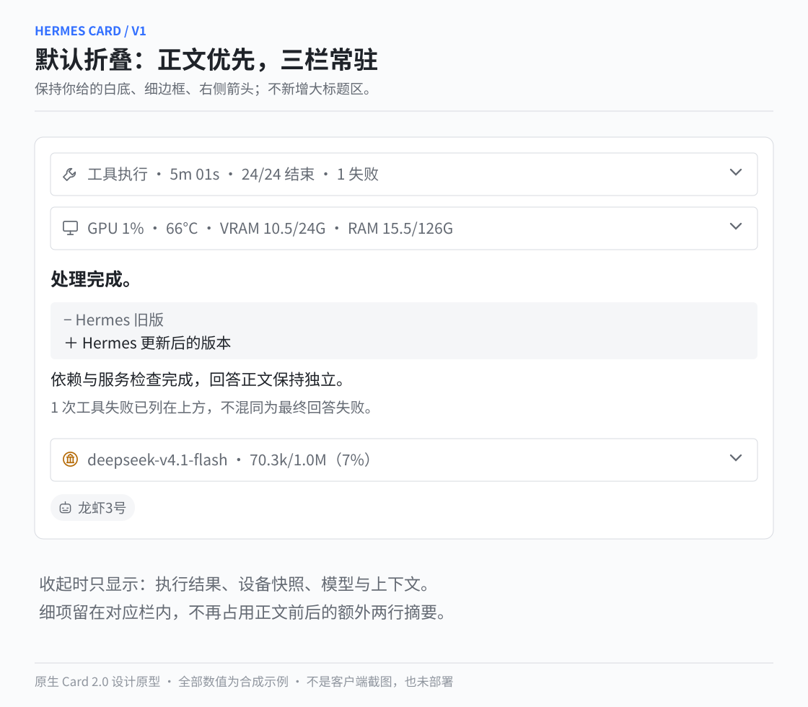
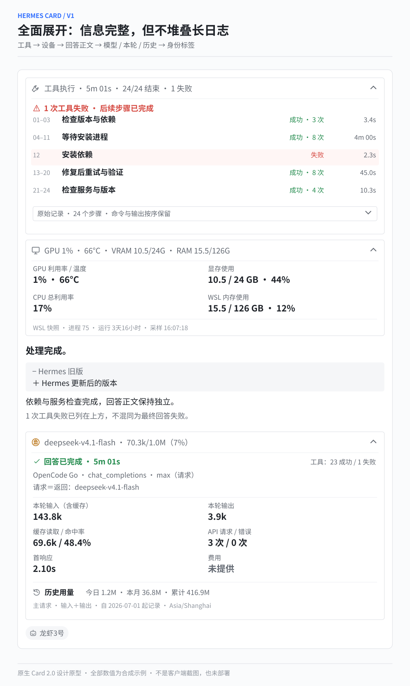
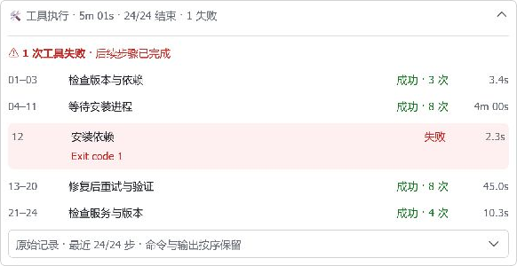
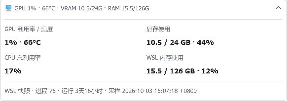
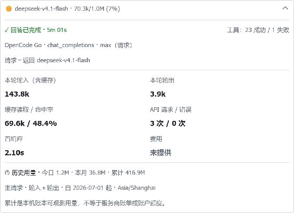
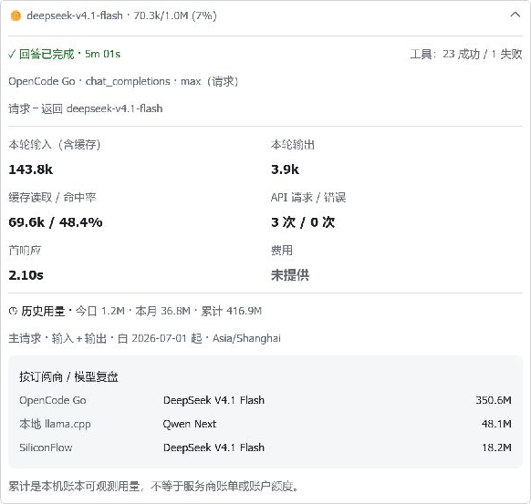

# 用户参考卡片 V1 — 设计基准与代码契约

2026-10-03，用户将本轮整卡设计冻结为 **V1**，要求实现后与图逐项对照。0.20.0 新布局已托管部署，Gateway 空闲重启与启动检查通过。本页将源码测试、部署、新轮次及客户端外观分开验收。

## 冻结设计





[工具放大图](assets/reference-v1-03-tools-detail.svg) · [资源放大图](assets/reference-v1-04-resources-detail.svg) · [Footer 放大图](assets/reference-v1-05-footer-detail.svg)

保留白底、灰色小标题、细边框、右侧箭头和身份标签。结构固定为：**工具 → 资源 → 回答正文 → 模型 / 用量 → 身份标签**。使用 [Feishu 原生 collapsible_panel](https://open.feishu.cn/document/feishu-cards/card-components/containers/collapsible-panel) 与 [column_set](https://open.feishu.cn/document/feishu-cards/card-components/containers/column-set)，不把整卡渲染成一张失去交互的图片。

## 配置（合并进已有配置，不覆盖其他内容）

```yaml
streaming:
  layout: reference       # 新 V1；不设置则保留原布局
  agent_name: "龙虾3号"   # 可选身份标签，不是修改飞书机器人身份
  resources:
    enabled: true        # 可选，主机快照，不是持续监控
  footer:
    mode: enhanced       # V1 需要增强统计
    enabled: true
    details: true
    text_size: notation # 标签小字，双列指标数值仍为 normal_v2
    history:
      enabled: true
      timezone: Asia/Shanghai
      show_models: false # 常规整卡仅今日/月/累计；true 增加前三组模型复盘
```

新布局 opt-in；资源采样与历史记录分别可关闭。Hermes 的模型/认证配置仍独立维护，不启动第二个 Gateway 或额外 Node 通道。运行安装走现有 Hermes PM，勿把开发解释器注入生产。

## 实现与口径

| 设计区域 | 源码实现 | 正确性约束 |
|---|---|---|
| 工具摘要 | `cardkit/reference.py` | 结束/成功/失败分开；保留失败累计与原始序号 |
| 重复进度 | `_tool_groups` | 只合并连续、同目标、无输出的成功 process poll；命令不自动合并 |
| 失败突出 | 有界优先选失败/运行中，再填最近步骤；保持选择后的顺序 | 较早省略项有明确数量，失败不被后来成功覆盖 |
| 原始记录 | 二级原生折叠面板 | 最近最多 24 步并限制文本字节；正文脱敏，超限明确显示 N/总数 |
| GPU/CPU/内存 | `footer/host.py` | GPU 0；CPU 相邻样本增量；MemTotal−MemAvailable；未知不是 0 |
| 采样运行 | 单控制器合并后台任务，10 秒缓存 | 不 busy-spin，不在 renderer 执行 shell，不为每个 delta 启动进程 |
| 模型/上下文标题 | `build_reference_footer` | 末次主请求上下文与本轮累计 Token 不混算 |
| 本轮详情 | 标签在上、数值在下的双列原生布局 | 输入包含缓存，缓存不重复加总；费用没有来源就保持未知 |
| 模型/思考来源 | 复用现有审计后的 collector | max 是请求值；请求与返回模型不同则显示两者 |
| 历史 | `footer/history_summary.py` | 只读 SQL、60 秒后台缓存、完成时刷新；主请求，非账号账单 |
| 历史模型表 | 可选前三组订阅标签＋返回/请求模型 | 完整按月/模型/订阅复盘仍走现有 history CLI；部分统计有星号 |
| 流式更新 | 现有 flush mutex / sequence | 不增加第二个写卡任务；内容/标题更新不发送 expanded 重置，包括二级原始记录 |

澄清/续卡后，既往调用数、结束数和失败数继续累计；模型主请求计数不把辅助摘要当作主回复。资源栏是带日期/时区的快照，WSL 与 Windows 范围不混同。后台复盘、思考、正文、附件及投递所有权继续沿用原机制。V1 三面板用于 Gateway 对话卡片；独立 Cron 和后台完成通知保留静态模板，不伪造不存在的本轮遥测。

## 有界预算

新布局保守预留 168 个递归元素。工具最多显示 8 组，原始记录合成一个有界 Markdown，历史模型表最多 3 行；字符与 JSON 字节限制分别处理。工具日志预算随行内容在 1–4 KB 之间调整，以免超长失败信息挤爆整卡。英文默认内容不重复保存三份，中文保持原生 i18n 覆盖；超长名称使用省略号，不伪造 ID 相等。原始 ID 差异判定仍复用原来的完整白名单值。

达到卡片元素/大小上限时，现有正文续卡/终态压缩继续工作。卡片显示收缩不是 LCM 上下文压缩，也不删除请求账本。长日志不承诺无限塞进同一张卡。

## 证据与剩余验收

- 本轮新增自动回归涵盖全部 226 个目录 ID 的 V1 路径、真实 controller 单写者行为、未知值、跨月时区、部分统计、主/辅助口径、采样合并和最坏 JSON/元素预算。
- [完成态 JSON](assets/reference-v1-completed.json)、[运行态 JSON](assets/reference-v1-running.json)、[历史表 JSON](assets/reference-v1-history.json) **来自真实 builder 的合成数据**，不是手写假成功响应。
- `scripts/build_reference_assets.py` 可重建上述 JSON；[结构检查](assets/reference-v1-inspection.json) 与服务端/客户端验收状态分列。
- 1406 项全量测试、Ruff 与 mypy（48 个源文件）通过，新增 V1 回归 254 项，含清单/包版本一致性回归。测试通过与实机验收分别记录。
- 托管插件已更新至审核提交 `541961a0d4e1c65eb936b0e5e9660b39d4585785`，版本清单与包均为 0.20.0；Tests / CodeQL 成功后空闲重启。配置仅修改已审核的展示字段，Hermes 和托管插件工作区均干净；模型、凭据、会话及数据库未迁移。
- 设计中的示例数字不会进入生产配置或生产用量账本；真实数据按来源显示。

## 真实飞书合成验收

[服务端检查](assets/reference-v1-server-checks.json) 记录最终 fixture 的 SHA-256，以及创建、投递、正文插入/流式更新、面板局部更新、关流、终态更新和 interactive 读取的成功回执。一次初始探针实际发现原始记录 ID 超过 20 字符，已修复为 `ref_tool_records` 并补回归；最新运行态实体再次创建/更新/关闭通过。该探针不调用模型，不写用量账本。

Windows 客户端直接展开工具、资源、Footer 和历史表，对照 V1 核实四列工具行、失败浅红底、双列数值、右对齐统计、原生分隔线和灰色复盘容器。二级原始记录打开后，真实局部更新没有将其收起。









截图仅裁出合成卡片，不包含聊天列表/私有生产用量。详情见 [客户端验收范围](assets/reference-v1-client-checks.json)。此证据证明当前桌面原生布局和交互，尚未宣称不同客户端字号、缩放及每个像素与设计画布完全一致。

## 托管部署检查

[部署记录](assets/reference-v1-deployment-checks.json) 单独记录运行版本与范围：Gateway 为 running、所有 doctor 检查通过、钩子兼容、账本只读 `quick_check` 正常，新进程启动日志无 traceback。

保留一条历史 `unknown` 投递回执；不通过删除回执或自动重发制造全绿。新进程尚无真实卡片轮次时，doctor 的 `metrics_stale` 仅表示缺少当前进程指标，不将重启前旧指标当成新进程成功/失败证据。

下一步：真实 Gateway 新轮次/续卡 → 手机/主题/缩放对照验收。绿色 CI、运行健康与外观一致性分别验收。
