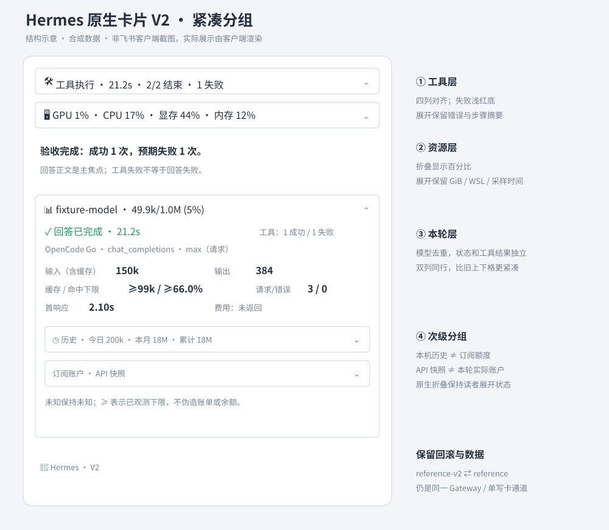
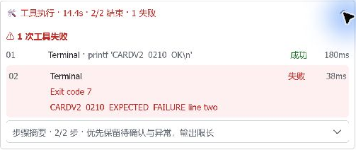

# V2 原生卡片 — 0.21.1（真实聊天验收：0.21.0）

V2 是本插件的设计版本，不是第二套 Hermes，也不改变 Feishu JSON schema 2.0。
只复用当前 Gateway、PM 依赖、采集口径、写卡通道和投递账本。

## 从真实桌面发现的问题到实现

| V1 问题 | V2 实现 |
|---|---|
| 同一请求/返回模型重复占一行 | 两者都已返回且相同才省略重复行；不同/缺失仍展示 |
| 六指标每格上下两行，Footer 展开偏高 | 双列标签与数值同行，沿用原始单位和缓存下限 |
| 多道分隔线把展开区切得零碎 | 原生边框分组；删掉重复的面板首分隔线 |
| 历史与本轮、账户平铺，信息层级模糊 | 本轮常驻；本机历史与账户 API 为两个次级折叠组 |
| GPU/RAM 折叠标题很长 | 折叠标题为 GPU/CPU/显存/内存百分比，展开保留 GiB/WSL/采样说明 |
| 工具失败和整轮回答成功易混淆 | 工具失败标题红色，回答状态保持独立，错误行/记录/未确认说明不删 |



外层仍为 **工具 → 资源 → 回答 → 模型/本轮 → 身份**，回答是主体。
不添加第四个一级面板。历史是本机账本，不冒充服务商的订阅余额。
所有一级/二级面板默认折叠，运行中部分更新不重置读者的展开状态。

## 实施计划与验收

1. 读取当前运行版本、官方组件与 SDK、社区 issues，观察现有 Windows 卡片。
2. 新增纯渲染 `reference_v2.py`，保留 V1；不重写协议适配/账本/sequence。
3. 增加布局、未知/部分值、请求/返回差异、终态、运行态、容器深度、预算和回滚测试。
4. 用当前 Hermes PM Python/依赖跑全套；真实 CardKit 创建/流式批量更新/关闭/全量更新。
5. 测试精确提交并推送维护 main；等待该提交的 Tests / CodeQL。
6. 备份配置和精确版本，空闲双检，平稳停止/更新/PM 同步/安装钩子/启动。
7. 在既有测试话题由桌面用户发一条真实消息，核对成功/预期失败工具、模型请求、账本、投递。
8. Windows 截图核对折叠、工具、摘要、资源、V2 Footer、历史和账户；只在真实证据取得后标通过。

源码测试、未挂聊天的服务端合成 API、真实 Gateway 回合和截图验收各自记证据；
合成示意不作逐像素承诺，旧图不标成 V2。长任务续卡、压缩、其他主题/缩放和多账户
真实计费不由这条短测试推导通过。

## 配置与回滚

```yaml
streaming:
  layout: reference-v2
  footer:
    mode: enhanced
    enabled: true
    details: true
```

已有历史/资源/账户设置保留。只在现有配置中替换 layout，不覆盖其他字段。
切回 `layout: reference` 并平稳重启即可恢复 V1；`classic` 仍保留。
账户/额度、时区与白名单使用 [现有配置](ACCOUNTS-AND-QUOTAS.md)，不创建新凭据。

## 代码边界

- `Config.card_layout` 把两代原生设计归一为 reference，版本通过 `design_version` 区分。
- `RuntimeFooterController` 保持当前循环、互斥、flush、结构恢复和单 writer。
- V2 以 V1 的已审核状态、数值与转义结果作紧凑呈现，避免第二份缓存/费用算法。
- 保持 `reference_tools`、`reference_resources`、`footer_details`、`loading_icon` 和记录 ID。
- 新历史组 ID 为 `ref_v2_history`，账户组继续 `ref_accounts`；容器深度限制单列测试。
- 不新增 Node SDK、CLI OAuth、第二个 WebSocket、数据库或定时任务；框架安装不是像素样式开关。

## 官方与上游参考（2026-10-05）

本轮以当前 core/PM 运行完成 1,899 项回归；原生 API 接受九状态（包括两次流式
batch、关闭后的全量更新与历史/账户嵌套）。随后取得 0.21.0 新真实聊天与 Windows 桌面截图；详见下方版本绑定验收。
维护 fork 当前无开放 issue/PR；上游 #115 配置缓存与 #114 锚点/sequence 修复
在本 fork 已有对应实现/回归，V2 保留而非重做；#116 压缩+插话的长回合组合
仍单独标记风险，本次短 API 测试不宣布解决。

- [原生折叠面板](https://open.feishu.cn/document/feishu-cards/card-components/containers/collapsible-panel)、[分栏](https://open.feishu.cn/document/feishu-cards/card-components/containers/column-set)：选择原生边框/箭头/比例列，保持平台行为。
- [larksuite/node-sdk](https://github.com/larksuite/node-sdk)、[channel-sdk-node](https://github.com/larksuite/channel-sdk-node)：认证/事件/流式传输是独立层；借鉴能力分层，不并行接管当前 Hermes 飞书连接。
- [维护 fork issues](https://github.com/wzgrx/hermes-lark-streaming/issues)、[上游 issues](https://github.com/Cheerwhy/hermes-lark-streaming/issues)：UI 版本不替代超时、续卡、后台投递等独立验收。

P0–P7 自检：诉求有对应信息容器；回答为唯一主焦点；工具/资源/回答/Footer 为四主题；
灰为辅助、红为错误、绿为回答完成；统一 4/8/12px 间距；比例列不依赖固定窗口宽。


## 真实用户聊天与桌面验收 — 0.21.0 / 2026-10-05

验收运行提交 `c68623c3e78615bf842635eadefc034c2625c475`，沿用正在使用的 Hermes
`0764e9165721fdec30a11cf5fb0ac255cb09bb6f`、托管 PM 依赖及既有测试话题。
由桌面登录用户只发送一条消息，机器人真实处理；没有将未挂聊天的 API 实体冒充真实回合。

| 验收层 | 实际结果 |
|---|---|
| 入站/工具 | 一条 Feishu 话题入站；两个独立终端调用，退出码依次 0/7；第二次为预期失败，不重试 |
| 模型/投递 | 三个主模型请求；一张确认投递的卡片；当前进程无 CardKit API 或完成错误 |
| 数据 | 输入/输出/缓存、命中率和请求次数与本机账本对齐；回答完成与工具失败分开 |
| 桌面 | 1292×732 当前窗口：折叠态、四列工具、受控 stdout、同行资源、Footer、历史和账户展开；两组独立折叠 |
| 账户 | 现有 Go 官方 API 三种额度窗口与重置时间显示；不是余额或订阅到期时间，也不猜本轮使用哪个账户 |
| 保持 | 配置/凭据不变；LCM、会话与用量数据库只读 quick_check 均正常；历史未知投递保留 |



只有受控命令/错误局部截图公开。历史、账户、私密聊天列表及原始日志留在本地。
`message.get` 的 native-card 兼容投影为客户端升级提示，投递类型/ID 一致；桌面实际
内容正常，因此不把兼容投影当作失效，也不声称该接口验证了整卡正文。

截图发现一个呈现缺陷：折叠 CPU 标题保留过多小数，与展开一位精度不一致。
**0.21.1** 只统一这处百分比精度并增加有限/缺失/异常/整数回归，不修改原始采集数据。
旧 0.21.0 卡片和证据保持原样；新版本源码/接口检查不冒充第二条真实聊天。
其他主题/缩放、长回合压缩+插话+续卡、多账户真实切换和账单仍另行验收。
